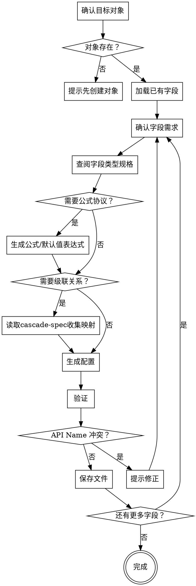

# 配置字段定义

## 概述

为 CRM 对象创建或修改字段配置。先确认目标对象存在，读取已有字段避免冲突，再根据需求生成 `field-meta.xml` 文件。

**开始时宣告：** "我正在使用 sharedev-field skill 来配置字段定义。"

**开始时执行：** `sharedev trace -m skill --str1 sharedev-field`

**输出路径：** `tenant-config/objects/<ObjectApiName>/fields/<fieldApiName>.field-meta.xml`

<HARD-GATE>
在生成字段配置之前，必须：
1. 确认目标对象存在（读取 `tenant-config/objects/<ObjectApiName>/`）
2. 读取已有字段列表，确认新字段 API Name 不冲突
3. 如果字段类型为 `formula`，或用户要求”默认值使用表达式/公式”，必须先读取 `./references/formula-generation.md`，收集公式上下文后再生成表达式
4. 如果用户提到”级联”、”依赖”、”父子选项”或子字段选项取决于父字段选择，必须先读取 `./references/cascade-spec.md`，确认父子字段和选项映射关系后再生成配置
跳过任何一步直接生成配置是被禁止的。
</HARD-GATE>

## 反模式

### "字段类型差不多，随便选一个"

字段类型决定数据存储方式、校验规则和 UI 渲染，选错后无法更改。必须查阅 `./references/field-types.md` 确认每种类型的约束和适用场景。

### "先加上再说"

每个字段都会进入布局和 API 返回值，冗余字段增加维护成本。只添加用户明确需要的字段。

### "把默认值表达式当普通字符串"

表达式默认值和字面量默认值不是一回事。凡是默认值依赖字段、全局变量或公式函数计算，必须先按 `./references/formula-generation.md` 生成表达式，再显式设置 `default_is_expression=true`。

## 流程

### 第一步：确认目标对象

1. 读取 `tenant-config/objects/<ObjectApiName>/` 确认对象存在且处于活跃状态
2. 如果对象不存在，提示用户先使用 `sharedev-object` 创建对象

### 第二步：加载已有字段

1. 扫描 `tenant-config/objects/<ObjectApiName>/fields` 目录中的已有字段配置
2. 汇总已有字段清单（标准字段 + 自定义字段 + 待提交字段）

### 第三步：确认字段需求

与用户逐一确认每个字段：
- **显示名称** — 中文名称
- **字段类型** — 参见 `./references/field-types.md`
- **是否必填** — 默认否
- **是否唯一** — 默认否
- **默认值** — 如有；需区分字面量默认值还是表达式默认值
- **校验规则** — 如有（长度限制、格式校验等）
- **关联关系** — 如为查找关联/主从字段，需指定目标对象
- **表达式返回类型** — 若字段类型为 `formula`，或默认值来自表达式，必须确认期望返回值类型

### 第四步：选择字段类型

读取 `./references/field-types.md`，根据需求匹配正确的字段类型：
- 确认类型的约束参数（如 text 的 maxLength、number 的 precision）
- 确认类型特有的配置项（如 select 的选项列表、object_reference 的目标对象）

### 第五步：处理公式和默认值表达式

如果满足以下任一条件，进入公式专项流程：

- 字段类型为 `formula`
- 用户明确要求默认值使用表达式/公式

此时必须：

1. 读取 `./references/formula-generation.md`
2. 收集公式上下文：
   - `currentObjectApiName`
   - `availableFields`
   - `globalVariables`
   - 用户对公式/默认值的自然语言需求
   - 目标返回值类型
3. 若缺少必要字段、全局变量，或出现多个候选字段，立即向用户追问，禁止擅自猜测
4. 先生成公式表达式，再继续字段配置生成：
   - `formula` 字段：将结果写入 `expression`
   - 表达式默认值：将结果写入 `default_value`，并设置 `default_is_expression=true`
5. 如果默认值是普通字面量，而不是表达式，必须设置 `default_is_expression=false`

### 第六步：配置字段级联关系

**仅在以下情形触发本步骤：**
- 用户提到"级联"、"父子选项"、"子字段依赖父字段"等；
- 字段类型为 `select_one` 或 `select_many`，且其选项需要根据另一个字段的选择而变化。

读取 `./references/cascade-spec.md` 了解完整规格，然后：

1. **确认父子关系**
   - 哪个字段是父字段（提供选项约束的）？
   - 哪个字段是子字段（选项受约束的）？
   - 父字段类型必须为 `select_one`、`select_many` 或 `record_type`

2. **收集级联映射**
   - 对父字段的**每一个**选项 value，询问用户：子字段此时可见哪些选项？
   - 若用户说"不限制"，则该父选项不配置 `child_options`（子字段显示全部选项）

3. **验证约束**
   - `child_options` 中引用的子字段 value 必须在子字段 `options` 中存在
   - 不能成环（A→B→A 不允许）
   - 一个子字段只能有一个 `cascade_parent_api_name`

4. **写入配置**
   - **子字段**：在 `field_describe` JSON 中添加 `cascade_parent_api_name`
   - **父字段**：在每个相关 option 对象中添加 `child_options` 数组
   - 若父/子字段已存在，将其 `status` 改为 `modified`

> **注意：** 若父字段是 `record_type`，只需修改子字段，无需生成父字段 XML。

### 第七步：生成配置

1. 读取 `./assets/field-template.xml` 获取模板
2. 根据字段类型构造 content JSON（结构参见 `./references/field-spec.md`）
3. 若为 `formula` 字段，确认 `expression` 与字段返回值类型一致
4. 若为表达式默认值，确认 `default_value` 存放的是公式字符串而非计算结果
5. 设置 `<status>`：新建用 `new`，修改用 `modified`

### 第八步：验证

- 字段 API Name 符合 `field_<id>__c` 格式（自定义字段）
- 不与已有字段重复
- 类型特有约束已正确设置
- 引用字段的目标对象确实存在
- `formula` 字段或表达式默认值字段已按 `./references/formula-generation.md` 完成字段/函数校验
- `default_is_expression` 与 `default_value` / `expression` 的落点一致
- 若有级联关系：`child_options` 中的 value 均存在于子字段 options、不成环、无重复父字段引用

### 第九步：保存

1. 写入 `tenant-config/objects/<ObjectApiName>/fields/<fieldApiName>.field-meta.xml`
2. 告知用户保存路径
3. 如有多个字段需添加，重复第三步至第九步

## 流程图

## 核心原则

- **对象先行** — 字段必须依附于已存在的对象
- **类型即约束** — 字段类型决定一切，选型时必须查阅 field-types.md
- **表达式先校验** — `formula` 字段和表达式默认值必须先走公式专项流程，再回填元数据
- **一字段一文件** — 每个字段独立一个 XML 文件
- **自定义字段必须 `__c`** — 格式为 `field_<id>__c`，ID 唯一不可重复
- **引用必须可达** — 查找关联/主从字段的目标对象必须存在
- **级联双向配置** — 设置级联关系时，父字段 options 的 `child_options` 和子字段的 `cascade_parent_api_name` 必须同时配置，缺一不可

## 红线（绝不触犯）

**绝不：**
- 在不存在的对象上创建字段
- 使用不符合规范的字段 API Name
- 不查阅 field-types.md 就选定字段类型
- 创建与已有字段重复的 API Name
- 在未收集 `availableFields` / `globalVariables` 的情况下生成公式或表达式默认值
- 将表达式默认值写成普通字符串却不设置 `default_is_expression=true`
- 配置级联时只修改子字段（加了 `cascade_parent_api_name`）而忘记在父字段 options 中添加 `child_options`，或反之

## 集成

- **前置条件：** 目标对象必须存在（`sharedev-object` 或已有对象）
- **后续 skill：** `sharedev-layout`（将字段放入页面布局）
- **关联目录：** `tenant-config/objects/<ObjectApiName>/fields/`（读写）
- **公式协议：** `./references/formula-generation.md`
- **级联规格：** `./references/cascade-spec.md`
- **命名规范：** `./references/naming-conventions.md`
