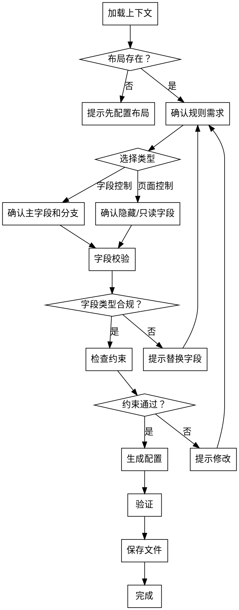

# 配置布局规则

## 概述

为 CRM 对象的布局创建规则，控制布局内字段的动态行为。布局规则有两种类型：

- **字段控制类型（field）** — 基于主字段的值，通过树形条件结构控制其他字段的显示、必填或只读状态
- **页面控制类型（page）** — 在新建或编辑页面上控制字段的隐藏或只读状态

**开始时宣告：** "我正在使用 sharedev-layout-rule skill 来配置布局规则。"

**开始时执行：** `sharedev trace -m skill --str1 sharedev-layout-rule`

**输出路径：** `tenant-config/objects/<ObjectApiName>/layout-rules/<ruleApiName>.layout-rule-meta.xml`

**目录说明：** `layout-rules/` 是新增目录，首次使用时需要创建。

<HARD-GATE>
在生成布局规则之前，必须：
1. 确认目标对象存在
2. 确认目标布局已存在于 `tenant-config/objects/<Obj>/layouts/` 中
3. 确认规则引用的所有字段存在于该布局中
4. 读取已有规则（如有），确认该布局规则总数不超过 10 条
5. 字段控制类型：确认主字段未被同布局的其他规则占用，确认不存在成环
6. 页面控制类型：确认同布局同页面类型（add/edit）不存在已有规则
规则引用不存在的字段或违反数量限制会导致规则无法正常生效。
</HARD-GATE>

## 反模式

### "每个字段一条规则"

相关联的字段控制应合并到同一条规则的分支中，而不是为每个字段创建独立规则。过多规则增加维护成本且更容易达到 10 条上限。

### "条件字段出现在叶子中"

成环会导致规则失效。例如 `【A=1】==> 显示A` 是成环——条件节点中的字段不能同时出现在该分支的叶子节点中。

### "隐藏和只读配置同一字段"

页面控制类型中，`hide_field` 和 `readonly_field` 互斥。同一字段不能同时配置在两个列表中。

### "从对象配置页面控制"

主从同时新建的从对象不允许配置页面控制类型布局规则。

## 流程

### 第一步：加载上下文

1. 确认目标对象存在（读取 `tenant-config/objects/<ObjectApiName>/`）
2. 确认目标布局存在（读取 `tenant-config/objects/<ObjectApiName>/layouts/`），获取布局内的字段列表
3. 读取 `tenant-config/objects/<ObjectApiName>/layout-rules/`（如目录存在），获取已有规则列表并统计数量

### 第二步：确认规则需求

与用户确认：

**选择规则类型：**

| 类型 | `type` | 适用场景 |
|------|--------|---------|
| 字段控制 | `"field"` | 根据某字段的值动态控制其他字段的显示/必填/只读 |
| 页面控制 — 新建 | `"page"` + `page_trigger_mode: "add"` | 在新建页面隐藏或只读某些字段 |
| 页面控制 — 编辑 | `"page"` + `page_trigger_mode: "edit"` | 在编辑页面隐藏或只读某些字段 |

**字段控制类型需确认：**
- **主字段** — 作为条件判断依据的字段（必须属于支持的字段类型，参见 spec）
- **分支条件** — 主字段满足什么条件时触发（操作符 + 条件值）
- **叶子效果** — 条件满足时，哪些字段被显示（show_field）、必填（required_field）、只读（readonly_field）

**页面控制类型需确认：**
- **隐藏字段** — 哪些字段在该页面隐藏（hide_field）
- **只读字段** — 哪些字段在该页面只读（readonly_field）
- 两者互斥，同一字段不能同时出现

### 第三步：字段校验

1. **字段控制类型：** 参见 `./references/layout-rule-spec.md` 的「字段类型支持矩阵」，校验：
   - 主字段是否属于支持的字段类型
   - 叶子节点-显示的字段是否为布局中非必填的支持类型字段
   - 叶子节点-必填的字段是否为布局中非必填、非只读的支持类型字段
   - 叶子节点-只读的字段是否属于支持类型
2. **页面控制类型：** 参见 `./references/layout-rule-spec.md` 的「页面控制字段类型支持矩阵」，校验：
   - 隐藏字段必须为布局中非必填且支持类型的字段
   - 只读字段必须为布局中非只读且支持类型的字段
   - 隐藏和只读字段不重叠

### 第四步：检查约束

1. **数量限制：** 该布局已有规则数 + 新规则 ≤ 10
2. **字段控制约束：**
   - 主字段未被同布局其他规则占用
   - 不存在成环（条件字段不出现在对应叶子中）
3. **页面控制约束：**
   - 同布局同页面类型（add/edit）没有已有规则
   - `hide_field` 和 `readonly_field` 无交集
4. **从对象约束：**
   - 主从同时新建的从对象不允许页面控制
   - 从对象布局规则不支持创建人、归属部门、负责人
5. 如发现冲突，提示用户修改后重新确认

### 第五步：生成配置

1. 读取 `./assets/layout-rule-template.xml` 获取模板
2. 构造 content JSON（字段名使用 snake_case，结构参见 `./references/layout-rule-spec.md`）：
   - 字段控制类型：构建 `main_field` + `main_field_branches` 树结构
   - 页面控制类型：构建 `page_trigger_mode` + `page_branches` 结构
3. JSON 中 `status` 设为 `1`（启用）
4. XML 中 `<status>`：新建用 `new`，修改用 `modified`

### 第六步：验证与保存

**验证：**
- 所有引用的字段 API Name 存在于目标布局中
- 规则 API Name 符合 `layout_rule_<id>__c` 格式
- JSON 结构完整，无缺失必填字段
- 约束检查均通过

**保存：**
1. 如 `layout-rules/` 目录不存在，先创建
2. 写入 `tenant-config/objects/<ObjectApiName>/layout-rules/<ruleApiName>.layout-rule-meta.xml`
3. 告知用户保存路径和规则生效范围

## 流程图

## 核心原则

- **布局先行** — 规则只能引用已存在布局中的字段
- **不成环** — 条件字段和叶子字段不能相同，否则规则失效
- **主字段唯一** — 同一布局内不同规则的主字段不可重复
- **页面控制互斥** — 隐藏和只读不能配置同一字段
- **数量有限** — 每布局最多 10 条规则（含两种类型）
- **合并优于拆分** — 相关联的字段控制应合并到同一规则的不同分支中

## 红线（绝不触犯）

**绝不：**
- 引用布局中不存在的字段
- 为同一布局创建超过 10 条规则
- 在字段控制中让条件字段和叶子字段成环
- 在页面控制中将同一字段同时配置为隐藏和只读
- 为主从同时新建的从对象创建页面控制规则
- 在从对象布局规则中使用创建人、归属部门、负责人字段

**如果用户要求的配置触及红线：**
- 明确说明不能执行的原因
- 建议替代方案（如拆分条件、使用其他字段类型、改用字段控制代替页面控制等）

## 集成

- **前置条件：** 目标布局必须存在（`sharedev-layout` 或已有布局）
- **后续 skill：** 无（本 skill 是配置管道的终点）
- **关联目录：** `tenant-config/objects/<Obj>/layouts/`（只读）、`tenant-config/objects/<Obj>/layout-rules/`（读写，新增目录）
- **规格文档：** `./references/layout-rule-spec.md`
- **命名规范：** `./references/naming-conventions.md`
- **可独立于 PWC 开发流程使用。** 当配置完成后需要开发自定义组件/插件时，使用 `write-prd-spec` 开始 PWC 开发流程。
