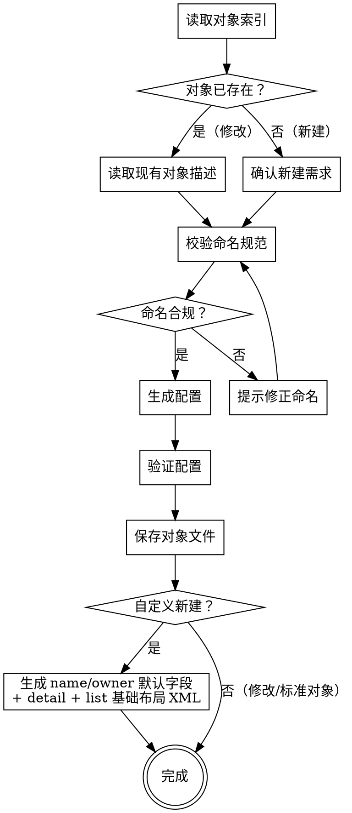

# 配置对象定义

## 概述

根据用户需求创建或修改 CRM 对象配置。先读取现有对象状态，再生成 `object-meta.xml` 文件。

**新建自定义对象时，必须同步产出 `name` / `owner` 默认字段、detail 详情布局和 list 移动端摘要布局，它们是对象可用的硬性前提。**

**开始时宣告：** "我正在使用 sharedev-object skill 来配置对象定义。"

**开始时执行：** `sharedev trace -m skill --str1 sharedev-object`

**输出路径：**
- 对象定义：`tenant-config/objects/<ObjectApiName>/<ObjectApiName>.object-meta.xml`
- 主属性字段（新建自定义对象时）：`tenant-config/objects/<ObjectApiName>/fields/name.field-meta.xml`
- 负责人字段（新建自定义对象时）：`tenant-config/objects/<ObjectApiName>/fields/owner.field-meta.xml`
- 详情布局（新建自定义对象时）：`tenant-config/objects/<ObjectApiName>/layouts/layout_<id>__c.layout-meta.xml`
- 移动端摘要布局（新建自定义对象时）：`tenant-config/objects/<ObjectApiName>/layouts/list_layout_<id>__c.layout-meta.xml`

<HARD-GATE>
在生成任何对象配置之前，必须先读取 `tenant-config/objects/` 目录确认对象是否已存在、API Name 是否冲突。跳过此步骤直接生成配置是被禁止的。
</HARD-GATE>

## 反模式

### "对象名随便起"

命名不遵循约定会导致后续字段、布局、规则全部出错。自定义对象必须使用 `__c` 后缀，标准对象不可修改 API Name。在生成配置前，必须查阅 `./references/naming-conventions.md` 确认命名规范。

### "只保存对象，不生成布局"

新建自定义对象时跳过 detail 和 list 布局生成，会导致对象在系统中无法正常渲染。这两份布局是对象可用的硬性前提，**必须与对象定义同步产出**。

### "只生成布局，不产出默认字段"

detail 和 list 布局骨架里都直接引用了 `name` 和 `owner`。新建自定义对象时若不产出这两个字段文件，布局落地后是悬空引用，会直接报错。**必须与对象、布局同步产出**。

### "顺手生成 edit 布局或 list_layout 布局"

edit 布局（新建/编辑页）和 list_layout 布局（Web 端列表页）**不是对象的默认配置**，它们需要根据业务场景单独决策。新建对象时默认不生成这两类布局，需用户显式触发 `sharedev-layout` 来创建。

## 流程

### 第一步：加载现有对象状态

1. 检查 `tenant-config/objects/` 目录，确认是否已有本地配置，是否是已有对象
2. 如果是修改现有对象，读取 `tenant-config/objects/<ObjectApiName>.object-meta.xml` 了解当前元数据

### 第二步：确认需求

与用户确认：
- **新建还是修改？** 新建需要全新 API Name；修改需要确认目标对象
- **显示名称**（中文，用于界面展示）
- **功能开关** — 需要启用哪些能力（多字段排序、记录修改、相关团队、全局搜索）
- **描述** — 对象用途说明

### 第三步：校验命名

读取 `./references/naming-conventions.md`，校验：
- 自定义对象：API Name 符合 `<name>__c` 格式
- 标准对象：不得修改 API Name
- 不与 `tenant-config/objects/` 中已有对象冲突

### 第四步：生成配置

1. 读取 `./assets/object-template.xml` 获取模板
2. 填充 `<content>` 中的 JSON（字段定义参见 `./references/object-spec.md`）
3. 设置 `<features>` 中的功能开关
4. 设置 `<status>`：新建用 `new`，修改用 `modified`

### 第五步：验证

- API Name 符合命名规范
- 功能开关值为 `true` 或 `false`
- content JSON 结构完整
- 不与已有对象重复

### 第六步：保存对象、默认字段与基础布局

1. 创建目录 `tenant-config/objects/<ObjectApiName>/`（含 `fields/` 和 `layouts/` 子目录）
2. 写入 `<ObjectApiName>.object-meta.xml`
3. **仅在新建自定义对象（`define_type = custom`，且此前对象目录不存在）时**，产出下列副产物：
   - `fields/name.field-meta.xml`（主属性，内容见"默认字段 JSON"）
   - `fields/owner.field-meta.xml`（负责人，内容见"默认字段 JSON"）
   - `layouts/layout_<id>__c.layout-meta.xml`（layout_type: `detail`，`is_default: true`）
   - `layouts/list_layout_<id>__c.layout-meta.xml`（layout_type: `list`，`is_default: true`）
   - **不生成** edit 布局与 list_layout（Web 端列表页）布局，这两类需用户显式触发 `sharedev-layout`
4. 标准对象（`define_type = package`）或修改已有对象时，**跳过第 3 步全部副产物**（不补默认字段，也不生成布局）
5. 告知用户所有保存路径，提示后续可使用 `sharedev-field` 添加其他字段

### 默认字段 JSON

字段 XML 外壳复用 `skills/sharedev-field/assets/field-template.xml`（`<ObjectField>` + `<content>` + `<status>`）。外层 `<status>` 填 `new`。完整 JSON 内容见 `./references/object-spec.md` §默认字段。这两个字段是 `sharedev-object` 的副产物，**不走 `sharedev-field` 的需求确认流程**，仅在"新建自定义对象"时产出，触发条件与 detail/list 布局一致。

### 布局骨架要求

布局 XML 外壳复用 `skills/sharedev-layout/assets/layout-template.xml`，外层 `<status>` 填 `new`。两份骨架的完整 content JSON 见 `skills/sharedev-layout/references/layout-spec.md` §新建自定义对象的默认布局骨架。

## 流程图

## 核心原则

- **先读后写** — 永远先加载现有状态再生成配置
- **命名即契约** — API Name 一旦创建不可更改，必须严格校验
- **标准与自定义分离** — 标准对象（package 类型）只能修改功能开关和显示名，不能修改 API Name
- **最小开关** — 功能开关只启用用户明确需要的，不默认全开
- **目录完整** — 创建对象时同步创建 fields/ 和 layouts/ 子目录
- **默认字段保底（仅新建自定义对象）** — 新建自定义对象时必须一次性产出 `name` 和 `owner` 字段，避免布局引用悬空

## 红线（绝不触犯）

**绝不：**
- 不读取 tenant-config/objects/ 就生成对象配置
- 使用不符合命名规范的 API Name
- 修改标准对象的 API Name
- 覆盖已有配置而不告知用户
- 新建自定义对象时不产出 detail 与 list 两份默认布局
- 新建自定义对象时不产出 `name` 与 `owner` 两个默认字段
- 默认为自定义对象生成 edit 或 list_layout 布局（这两类按需由用户触发）

**如果用户要求的对象名冲突：**
- 明确告知冲突对象的信息
- 建议使用不同名称或确认是修改而非新建

## 集成

- **前置条件：** 无（本 skill 是配置管道的起点）
- **后续 skill：**
  - 新增字段 → `sharedev-field`
  - 需要 Web 端列表页布局 → `sharedev-layout`（layout_type: `list_layout`）
  - 需要独立新建/编辑页布局 → `sharedev-layout`（layout_type: `edit`，需用户显式开启）
- **关联目录：** `tenant-config/objects/`（读写）
- **可独立于 PWC 开发流程使用。** 当配置完成后需要开发自定义组件/插件时，使用 `write-prd-spec` 开始 PWC 开发流程。
