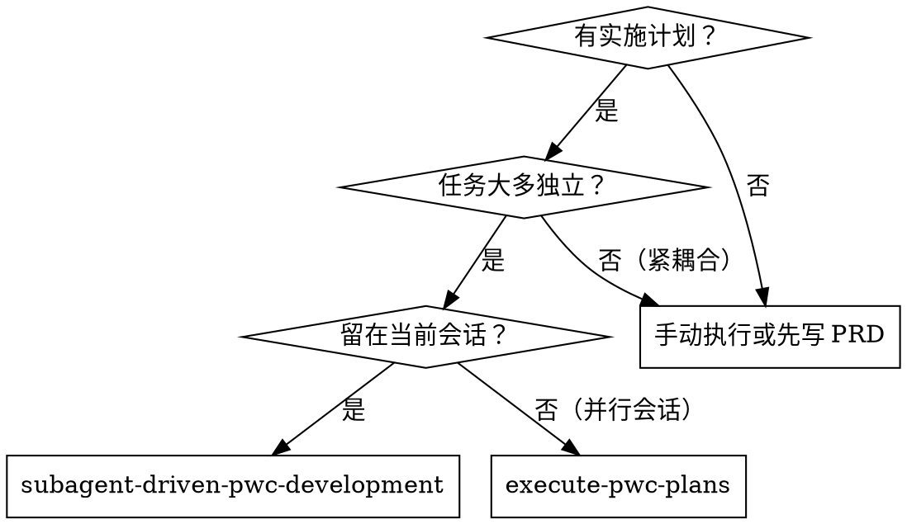
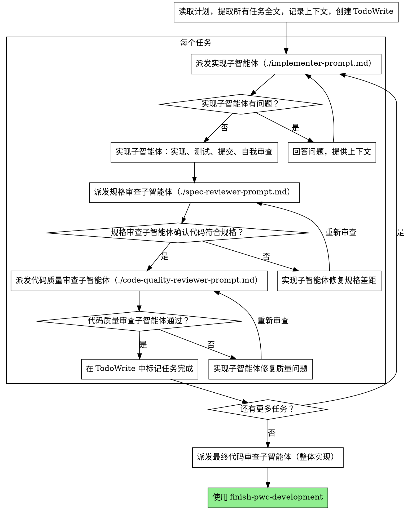

# 子智能体驱动的 PWC 开发

通过为每个任务派发独立子智能体来执行计划，每个任务完成后进行两阶段审查：先做规格合规审查，再做代码质量审查。

**开始时执行：** `sharedev trace -m skill --str1 sharedev-pwc-subagent-driven-development`

**为什么使用子智能体：** 你将任务委托给具有独立上下文的专用智能体。通过精确构建其指令和上下文，确保它们保持专注并成功完成任务。子智能体绝不应继承你的会话上下文或历史记录——你构建的是它们所需的精确内容。这也保留了你自己的上下文用于协调工作。

**核心原则：** 每个任务使用独立子智能体 + 两阶段审查（规格合规 → 代码质量）= 高质量、快速迭代

## 何时使用



**vs. 执行计划（并行会话）：**
- 同一会话（无上下文切换）
- 每个任务使用独立子智能体（无上下文污染）
- 每个任务后进行两阶段审查：先规格合规，再代码质量
- 更快迭代（任务间无需等待人工介入）

## 流程



## 模型选择

使用能完成每个角色的最低配置模型，以节省成本并提升速度。

**机械性实现任务**（独立函数、规格清晰、1-2 个文件）：使用快速、低成本模型。当计划规格完善时，大多数实现任务都是机械性的。

**集成和判断任务**（多文件协调、模式匹配、调试）：使用标准模型。

**架构、设计和审查任务**：使用最强大的可用模型。

**任务复杂度信号：**
- 涉及 1-2 个文件且规格完整 → 低成本模型
- 涉及多文件且有集成需求 → 标准模型
- 需要设计判断或广泛的代码库理解 → 最强大模型

## 处理实现子智能体状态

实现子智能体报告以下四种状态之一，每种状态对应不同处理方式：

**DONE：** 进入规格合规审查。

**DONE_WITH_CONCERNS：** 实现子智能体完成工作但标记了疑虑。在继续前阅读这些疑虑。如果疑虑关于正确性或范围，在审查前解决。如果是观察性意见（如"这个文件变大了"），记录后继续进行审查。

**NEEDS_CONTEXT：** 实现子智能体需要未提供的信息。提供缺失上下文并重新派发。

**BLOCKED：** 实现子智能体无法完成任务。评估阻塞因素：
1. 如果是上下文问题，提供更多上下文并用同一模型重新派发
2. 如果任务需要更多推理，用更强大的模型重新派发
3. 如果任务过大，将其拆分为更小的部分
4. 如果计划本身有问题，向用户上报

**绝不**忽视升级信号或在不做任何改变的情况下强制同一模型重试。如果实现子智能体说它卡住了，就需要改变某些东西。

## Prompt 模板

- `./implementer-prompt.md` - 派发实现子智能体
- `./spec-reviewer-prompt.md` - 派发规格合规审查子智能体
- `./code-quality-reviewer-prompt.md` - 派发代码质量审查子智能体

## 示例工作流

```
你：我正在使用子智能体驱动开发来执行这个计划。

[读取计划文件一次：deliverables/2026-04-01-customer-form/plan.md]
[提取所有 5 个任务的全文和上下文]
[用所有任务创建 TodoWrite]

任务 1：客户表单组件骨架

[获取任务 1 全文和上下文（已提取）]
[派发实现子智能体，包含完整任务文本 + 上下文]

实现子智能体："开始前确认——表单是否需要支持新建和编辑两种模式？"

你："是的，通过 customerId prop 判断，有值为编辑，无值为新建"

实现子智能体："明白，开始实现..."
[稍后] 实现子智能体：
  - 实现了 CustomerForm.vue 组件骨架
  - 添加了单元测试，4/4 通过
  - 自我审查：发现缺少 loading 状态处理，已补充
  - 已提交

[派发规格合规审查子智能体]
规格审查子智能体：✅ 规格合规——所有需求已满足，无多余实现

[获取 git SHA，派发代码质量审查子智能体]
代码质量审查子智能体：优点：组件结构清晰，测试覆盖完整。问题：无。已通过。

[标记任务 1 完成]

任务 2：表单字段和校验逻辑

[获取任务 2 全文和上下文（已提取）]
[派发实现子智能体，包含完整任务文本 + 上下文]

实现子智能体：[无问题，直接进行]
实现子智能体：
  - 添加了所有表单字段和校验规则
  - 8/8 测试通过
  - 自我审查：一切正常
  - 已提交

[派发规格合规审查子智能体]
规格审查子智能体：❌ 问题：
  - 缺失：手机号唯一性异步校验（规格中有要求）
  - 多余：添加了邮箱字段（未在需求中）

[实现子智能体修复问题]
实现子智能体：已移除邮箱字段，添加手机号异步唯一性校验

[规格审查子智能体重新审查]
规格审查子智能体：✅ 规格合规

[派发代码质量审查子智能体]
代码质量审查子智能体：优点：扎实。问题（Important）：异步校验未处理网络错误

[实现子智能体修复]
实现子智能体：已添加网络错误兜底处理

[代码质量审查子智能体重新审查]
代码质量审查子智能体：✅ 通过

[标记任务 2 完成]

...

[所有任务完成后]
[派发最终代码审查子智能体]
最终审查子智能体：所有需求已满足，可以交付

完成！
```

## 优势

**vs. 手动执行：**
- 子智能体自然遵循 TDD
- 每个任务使用独立上下文（无混淆）
- 并行安全（子智能体互不干扰）
- 子智能体可以在工作前后提问

**vs. 执行计划：**
- 同一会话（无交接）
- 持续推进（无需等待）
- 自动设置审查检查点

**效率提升：**
- 无文件读取开销（控制器提供全文）
- 控制器精确管理所需上下文
- 子智能体预先获得完整信息
- 问题在工作开始前浮现（而非之后）

**质量关卡：**
- 自我审查在交接前捕获问题
- 两阶段审查：规格合规 → 代码质量
- 审查循环确保修复真正有效
- 规格合规防止过度/欠缺实现
- 代码质量确保实现质量良好

**成本：**
- 更多子智能体调用（每个任务：实现 + 2 个审查）
- 控制器需要更多准备工作（提前提取所有任务）
- 审查循环增加迭代次数
- 但能提前捕获问题（比后期调试成本更低）

## 红线（绝不触犯）

**绝不：**
- 未经用户明确同意在 main/master 分支上开始实现
- 跳过审查（规格合规或代码质量）
- 在未修复问题的情况下继续
- 并行派发多个实现子智能体（会产生冲突）
- 让子智能体读取计划文件（提供全文代替）
- 跳过场景设定上下文（子智能体需要了解任务所处位置）
- 忽视子智能体的问题（回答后再让其继续）
- 对规格合规接受"差不多"（审查者发现问题 = 未完成）
- 跳过审查循环（审查者发现问题 = 实现者修复 = 再次审查）
- 让实现者自我审查替代正式审查（两者都需要）
- **在规格合规未通过前开始代码质量审查**（顺序错误）
- 在任何一个审查有未解决问题时进入下一任务

**如果子智能体提问：**
- 清晰完整地回答
- 如有需要提供额外上下文
- 不要催促其进入实现阶段

**如果审查者发现问题：**
- 实现者（同一子智能体）修复问题
- 审查者再次审查
- 重复直到通过
- 不要跳过重新审查

**如果子智能体任务失败：**
- 用具体指令派发修复子智能体
- 不要手动修复（会污染上下文）

## 集成

**所需工作流 skill：**
- **write-pwc-plans** - 创建此 skill 执行的计划
- **review-pwc-code** - 审查子智能体的代码审查模板
- **finish-pwc-development** - 所有任务完成后结束开发
- **execute-pwc-plans** - 并行会话替代方案
