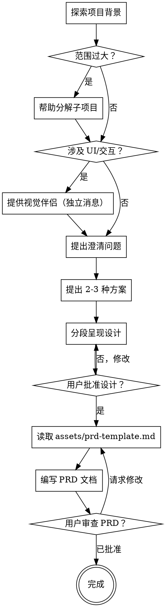

# 将想法转化为产品需求文档

通过自然的协作对话，帮助将想法转化为完整的产品需求文档（PRD）。

首先了解当前项目背景，然后逐一提问以完善想法。一旦理解了要构建的内容，呈现产品需求并获得用户批准，最终输出一份书面 PRD。

**开始时执行：** `sharedev trace -m skill --str1 sharedev-pwc-write-prd-spec`

<HARD-GATE>
在呈现产品需求并获得用户批准之前，不得编写代码、调用技术设计技能或采取任何实现行动。本 skill 的唯一产出是 PRD 文档，不涉及技术方案和代码实现。
</HARD-GATE>

## 反模式："这太简单了，不需要设计"

每个项目都要经历这个过程。待办列表、单函数工具、配置变更——全部如此。"简单"项目恰恰是未经审视的假设造成最多浪费工作的地方。设计可以很简短（对于真正简单的项目几句话即可），但你必须呈现它并获得批准。

## 检查清单

你必须为以下每项创建任务，并按顺序完成：

1. **探索项目背景** — 检查文件、文档、近期提交；评估范围，必要时帮助用户分解子项目
2. **提供视觉伴侣**（如涉及 UI 流程/界面描述）— 作为独立消息发送，不与其他内容合并
3. **提出澄清问题** — 逐一提问，了解目的/约束/成功标准
4. **提出 2-3 种方案** — 包含权衡分析和你的推荐
5. **呈现设计** — 按复杂度分段呈现，每段后获取用户批准
6. **读取模板** — 读取 `assets/prd-template.md` 获取 PRD 结构
7. **编写 PRD 文档** — 按模板结构填充内容，保存至 `deliverables/YYYY-MM-DD-<功能名称>/prd.md`
8. **用户审查 PRD** — 请用户审查并批准 PRD 文档

## 流程图

**终态是完成 PRD 文档。** 本 skill 只负责产品需求文档的编写，不涉及技术设计和实现。

## 流程详解

**理解想法：**

- 首先了解当前项目状态（文件、文档、近期提交）
- 在提出详细问题之前，评估范围：如果请求描述了多个独立子系统（例如"构建一个包含聊天、文件存储、计费和分析的平台"），立即标记。不要花时间细化一个需要先分解的项目的细节。
- 如果项目对单个规格而言太大，帮助用户分解为子项目：有哪些独立部分，它们如何关联，应以什么顺序构建？然后通过正常设计流程推进第一个子项目。每个子项目有其自己的 PRD → 架构 → 实现周期。
- 对于范围合适的项目，逐一提问以完善想法
- 尽可能选择多选题，但开放式问题也可以
- 每条消息只问一个问题——如果某个话题需要更多探讨，拆分为多个问题
- 关注理解：目的、约束、成功标准

**视觉伴侣：**

当你预判后续问题会涉及视觉内容（UI 流程、界面布局、交互图示）时，以独立消息提供一次邀请：

> "我们要讨论的部分可能用可视化方式更容易说清楚，我可以在浏览器中展示流程图、界面草图或交互对比。需要开启这个功能吗？（需要打开本地 URL）"

**此邀请必须作为独立消息发送**，不得与澄清问题或其他内容合并。等待用户响应后再继续。如果用户拒绝，继续纯文字流程。

**探索方案：**

- 提出 2-3 种不同方案及权衡分析
- 以对话方式呈现选项，包含你的推荐和理由
- 以推荐方案开头并解释原因

**呈现产品设计：**

- 一旦你认为理解了要构建的内容，呈现产品设计
- 根据复杂度调整每个部分：简单明了时几句话，复杂时最多 200-300 字
- 每节后询问是否正确
- 涵盖：功能描述、用户场景、交互流程、验收标准
- 随时准备回溯澄清不清楚的地方

**产品功能的清晰性：**

- 将功能拆分为更小的用户故事，每个故事有一个明确的用户价值
- 对于每个功能点，你应该能回答：它解决什么问题、谁会使用它、如何衡量成功？
- 用户能不了解技术实现就理解功能的价值吗？能清楚描述使用场景吗？如果不能，需求描述需要改进。

**在现有产品中工作：**

- 在提出新功能之前，了解当前产品的功能和用户体验。遵循既有的产品风格。
- 如果现有产品存在影响新功能的问题（例如用户体验不一致、功能冲突），将改进建议作为 PRD 的一部分。
- 不要提出无关的产品改进。专注于服务当前目标。

## PRD 完成后

**文档：**

- 读取与本 skill 同级的 `assets/prd-template.md`，以该模板结构为基础填充 PRD 内容
- 将填充后的文档保存至 `deliverables/YYYY-MM-DD-<功能名称>/prd.md`
  - （用户对 PRD 位置的偏好优先于此默认值）
- 模板中的 `{{占位符}}` 全部替换为实际内容，无内容的可选章节标注 `暂不涉及`，不得留空

**用户审查关卡：**
文档写完后，请用户审查书面 PRD：

> "PRD 已写入至 `<路径>`。请审查它，如需在开始后续工作之前进行任何修改，请告知我。"

等待用户响应。如果他们请求修改，进行修改后再次请用户确认。仅在用户批准后完成本 skill。

**后续工作：**

- PRD 完成后，调用 `write-pwc-arch` skill 进行技术架构设计
- 或直接调用 `write-pwc-plan` skill 进行实施计划编写
- 本 skill 只负责产品需求文档，不涉及技术实现

## 核心原则

- **每次一个问题** — 不要用多个问题压倒用户
- **优先多选题** — 尽可能比开放式问题更容易回答
- **严格 YAGNI** — 从所有设计中删除不必要的功能
- **探索替代方案** — 在确定之前始终提出 2-3 种方案
- **渐进式验证** — 呈现设计，在继续之前获得批准
- **保持灵活** — 当某些内容不合理时，回溯澄清
