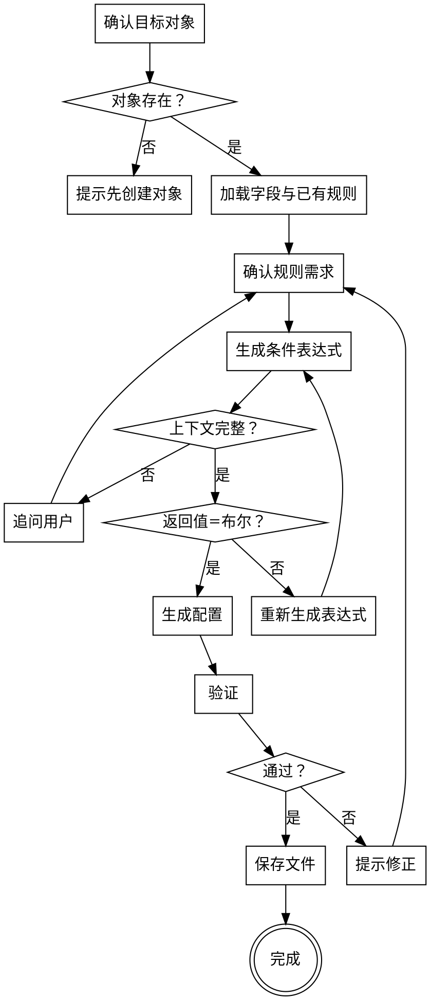

# 配置验证规则

## 概述

为 CRM 对象创建或修改验证规则（Validation Rule）。验证规则在保存（新建/编辑）时校验业务数据，若条件表达式结果为 `true`，则按「阻断」或「不阻断」策略提示错误信息。

**开始时宣告：** "我正在使用 sharedev-validation-rule skill 来配置验证规则。"

**开始时执行：** `sharedev trace -m skill --str1 sharedev-validation-rule`

**输出路径：** `tenant-config/objects/<ObjectApiName>/validation-rules/<ruleApiName>.validation-rule-meta.xml`

**目录说明：** `validation-rules/` 是新增目录，首次使用时需要创建。

<HARD-GATE>
在生成验证规则之前，必须：
1. 确认目标对象存在（读取 `tenant-config/objects/<ObjectApiName>/`）
2. 加载对象字段清单（标准字段 + 自定义字段 + 查找关联可达字段）以校验表达式引用
3. 读取已有验证规则，确认新规则 API Name 不冲突
4. 与用户确认：规则名称、是否启用、错误提示、阻断/不阻断、触发时机（新建/编辑）、空值处理（默认为0/默认为空）
5. 进入公式生成专项流程：必须先读取 `../sharedev-field/references/formula-generation.md`，并叠加本 skill 的 `./references/formula-extension.md` 中验证规则专属约束（返回值类型固定为「布尔」、空值处理语义、Lookup 统计字段实时性）
6. 主从同时新建场景下，若目标对象是从对象且策略为「不阻断」，必须显式提醒用户该规则不生效

跳过任何一步直接生成配置是被禁止的。
</HARD-GATE>

## 反模式

### "公式返回值随便写"

验证规则表达式的最终结果必须是布尔型（true=触发提示）。如果生成的公式直接返回数值或字符串，规则不会生效。所有公式生成完毕后必须显式校验返回值类型为「布尔」。

### "把错误提示当成日志写"

错误提示是给业务用户看的。直接写「expression evaluation failed」之类技术语言不能帮助用户改数据。错误提示必须用业务语言，并明确告知哪条数据、哪个字段不符合规则。

### "Lookup 统计字段当实时值用"

验证规则中通过 Lookup 取查找关联对象的统计字段时，取的是数据库中已保存的值，而不是本次提交后的实时统计值。涉及当前对象/主对象/兄弟从对象作为统计来源时，需要在「特殊说明」中明确告知用户，避免出现「第一次保存放过，第二次再编辑才拦截」的迷惑现象。

### "阻断/不阻断默认不问就选"

阻断会拦截保存，不阻断只是预警。这是一条规则的核心策略，必须显式向用户确认，不能擅自默认。从对象在主从同时新建时，「不阻断」规则不生效——必须把这一点告知用户。

### "新建和编辑都默认勾上不确认"

平台允许用户选择仅在新建/仅在编辑/两者触发，至少选一个。必须显式与用户确认，不能假设两者都开。

## 流程

### 第一步：确认目标对象

1. 读取 `tenant-config/objects/<ObjectApiName>/` 确认对象存在
2. 注意对象是否为从对象（主从关系中的 detail 端），如是，记录这一点以供后续提醒

### 第二步：加载已有字段与已有规则

1. 扫描 `tenant-config/objects/<ObjectApiName>/fields/` 收集 `availableFields`：字段 API Name、显示名、字段类型、选项值
2. 对于公式中需要引用的查找关联字段，按需读取目标对象的字段（用于 `$a__r.b$` 形式）
3. 扫描 `tenant-config/objects/<ObjectApiName>/validation-rules/`（若存在），获取已有规则的 API Name 列表与中文名，避免冲突

### 第三步：确认规则需求

与用户逐项确认：

| 配置项 | 说明 | 默认 |
|--------|------|------|
| **规则名称（rule_name）** | 中文显示名 | 必填，无默认 |
| **是否启用（is_active）** | `true`=启用；`false`=禁用 | 启用 |
| **规则描述（description）** | 业务上下文说明 | 可空 |
| **错误提示（message）** | 触发后展示给用户的文案 | 必填 |
| **阻断保存动作（enable_blocking）** | true=阻断，false=不阻断（仅提示，用户可继续保存） | 阻断 |
| **触发时机（scene）** | `"create"` / `"update"`，至少选一个 | 两者都有 |
| **空值处理（default_to_zero）** | `true`=字段为空按 0 参与计算；`false`=按空值参与 | `zero` |
| **条件表达式（condition）** | 进入第四步生成 | — |

**针对从对象的额外提醒：**
- 主从同时新建时，从对象只校验「阻断」规则，「不阻断」规则不生效
- 从对象的验证规则不支持创建人、归属部门、负责人字段作为校验项

### 第四步：生成条件表达式（公式专项）

公式生成必须遵循双协议：

1. **基础协议** — 读取 `../sharedev-field/references/formula-generation.md`，按其规定收集上下文、校验函数与字段、按规则生成表达式
2. **验证规则扩展** — 读取 `./references/formula-extension.md`，叠加以下约束：
   - `expectedReturnType` 固定为 `布尔`
   - `mode` 标记为 `validation_rule`
   - 当用户选择「默认为0」时，可在公式中按 0 处理空数值字段；选择「默认为空」时，必须显式使用 `ISNULL` / `NULLVALUE` 处理潜在空值
   - 涉及 Lookup 统计字段时，在「特殊说明」中提示实时性问题

收集到的上下文必须包含：

- `currentObjectApiName`
- `availableFields`（含本对象字段 + 可达 Lookup 对象字段）
- `globalVariables`
- `userLastInput`（用户自然语言描述）
- `expectedReturnType = 布尔`
- `mode = validation_rule`
- `default_to_zero = true | false`

如果上下文缺失，立即向用户追问，禁止擅自猜测。

生成完成后，公式协议会输出四段式（公式、返回值类型、公式分析、特殊说明）。从中提取「公式」作为 `expression`，其余内容用于人工核对与告知用户。

### 第五步：生成配置

1. 读取 `./assets/validation-rule-template.xml` 获取模板
2. 构造 content JSON（结构参见 `./references/validation-rule-spec.md`）：
   - `api_name` 使用 `validation_rule_<id>__c` 格式
   - `condition` 写入公式字符串原文，不要加额外引号、不要在两端套大括号
   - `enable_blocking` / `scene` / `default_to_zero` 按用户确认填入
   - `is_active` 设为 `true`（启用）或 `false`（禁用）
3. XML `<status>`：新建用 `new`，修改用 `modified`

### 第六步：验证

- 规则 API Name 符合 `validation_rule_<id>__c` 格式，未与已有规则冲突
- `condition` 中所有字段 API Name 在 `availableFields` 中可达
- `condition` 仅使用允许的函数（参见 formula-generation.md）
- `condition` 最终返回值类型为「布尔」
- `scene` `"create"`,`"update"`至少有一个，不能为空
- `message` 不为空
- `default_to_zero` 与公式中的空值处理写法一致

### 第七步：保存

1. 若 `validation-rules/` 目录不存在，先创建
2. 写入 `tenant-config/objects/<ObjectApiName>/validation-rules/<ruleApiName>.validation-rule-meta.xml`
3. 告知用户保存路径，并复述：
   - 规则将在何时触发（新建/编辑）
   - 阻断或不阻断
   - 涉及 Lookup 统计字段时复读实时性提示
   - 从对象「不阻断」规则在主从同时新建时不生效（如适用）

## 流程图

## 核心原则

- **对象先行** — 验证规则必须依附于已存在的对象
- **返回值必为布尔** — 表达式最终必须解析为 true/false，否则规则不会生效
- **公式协议复用** — 公式生成沿用 `sharedev-field/references/formula-generation.md`，验证规则只叠加扩展约束（布尔返回、空值语义、Lookup 实时性）
- **业务语言写提示** — 错误提示给用户看，不写技术日志
- **阻断与触发显式确认** — 阻断/不阻断、新建/编辑触发必须问用户，不擅自默认
- **空值语义闭环** — 「默认为0/默认为空」与公式中的空值处理必须一致

## 红线（绝不触犯）

**绝不：**
- 在不存在的对象上创建验证规则
- 生成的 `condition` 引用 `availableFields` 之外的字段
- 公式返回非布尔类型
- 跳过 formula-generation.md 直接拼写表达式
- 让 `scene` 同时为空或者空数组
- 在「默认为空」配置下让公式中出现 `$field$ == null` 这种不合法写法
- 默默把「不阻断」配在主从同时新建的从对象上不提示

**如果用户要求的配置触及红线：**
- 明确说明为什么不能这样配
- 给出替代方案（拆分规则、调整空值处理、改为阻断等）

## 集成

- **前置条件：** 目标对象必须存在（`sharedev-object` 或已有对象）；引用的字段必须存在（`sharedev-field` 或已有字段）
- **后续 skill：** 无（本 skill 是规则配置管道的终点之一）
- **关联目录：** `tenant-config/objects/<Obj>/fields/`（只读）、`tenant-config/objects/<Obj>/validation-rules/`（读写，新增目录）
- **公式协议：** `../sharedev-field/references/formula-generation.md` + `./references/formula-extension.md`
- **规格文档：** `./references/validation-rule-spec.md`
- **命名规范：** `./references/naming-conventions.md`
- **可独立于 PWC 开发流程使用。** 当配置完成后需要开发自定义组件/插件，再使用 `write-prd-spec` 开启 PWC 开发流程。
