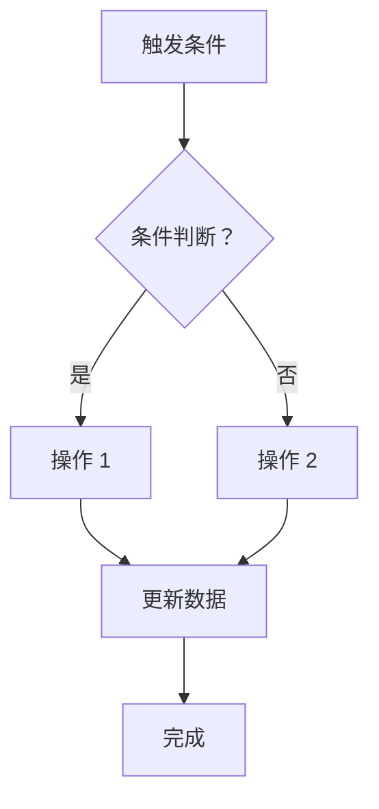

# 函数需求规格说明书 (PRD Template)

## 📋 文档信息

- **文档版本**: v1.0
- **生成时间**: YYYY-MM-DD HH:mm:ss
- **AI Assistant**: OpenClaw Groovy Function Generator

---

## 一、基本信息

| 字段 | 内容 |
|------|------|
| **函数名称** | [函数 ApiName] |
| **对应文件** | `[函数 ApiName].groovy` |
| **绑定对象** | [对象中文名] (`[对象 ApiName]`) |
| **触发类型** | [按钮 / 工作流 / 计划任务 / UI 事件 / 导入验证] |
| **执行环境** | [1 端 / N 端 / M 端] |
| **优先级** | [高 / 中 / 低] |

---

## 二、业务描述

### 2.1 需求标题

[从需求文档提取的需求标题]

### 2.2 需求详细描述

[从需求文档提取的完整业务逻辑描述]

### 2.3 业务流程图



---

## 三、技术实现

### 3.1 输入参数

| 参数名 | 类型 | 来源 | 说明 |
|--------|------|------|------|
| `context.data` | Map | 当前表单数据 | 包含所有字段值 |
| `context.objectIds` | List<String> | 选中记录 ID | 列表页操作时 |
| `field_xxx__c` | String | context.data | 具体字段示例 |

### 3.2 涉及对象及字段

#### 主对象：[对象中文名] (`[对象 ApiName]`)

| 字段 API Name | 字段中文名 | 操作类型 | 说明 |
|--------------|------------|----------|------|
| `_id` | 唯一标识 | 查询/更新 | 对象主键 |
| `field_a__c` | 字段 A | 读取 | 用于条件判断 |
| `field_b__c` | 字段 B | 更新 | 写入计算结果 |

#### 关联对象 1: [对象中文名] (`[对象 ApiName]`)

| 字段 API Name | 字段中文名 | 操作类型 | 说明 |
|--------------|------------|----------|------|
| `_id` | 唯一标识 | 查询 | 通过主对象 field_a__c 关联 |
| `field_c__c` | 字段 C | 读取 | 取值回填到主对象 |

#### 关联对象 2: ...

### 3.3 核心逻辑步骤

```
Step 1: [获取输入数据]
  - 从 context.data 获取 XXX
  - 或从 context.objectIds 获取选中 ID 列表

Step 2: [条件判断]
  if (条件 1):
    → 分支 A 逻辑
  elif (条件 2):
    → 分支 B 逻辑
  else:
    → 默认处理

Step 3: [关联查询]
  - 使用 Fx.object.findOne/findById 查询关联对象
  - 提取需要的字段值

Step 4: [数据处理]
  - 数据类型转换
  - 业务规则计算
  - 缓存中间结果 (如需要)

Step 5: [回写数据]
  - Fx.object.update 单条更新
  - Fx.object.batchUpdate 批量更新
  - UIEvent.editMaster UI 字段回填

Step 6: [返回结果]
  - ValidateResult (校验场景)
  - UIEvent (UI 事件场景)
  - void (其他场景)
```

### 3.4 伪代码

```groovy
// Step 1: 获取输入
String inputValue = context.data["field_input__c"] as String

// Step 2: 条件判断
if(inputValue != null && inputValue != ""){
    
    // Step 3: 关联查询
    def (boolean error, Map data, String msg) = Fx.object.findOne(
        "RelatedObject__c",
        FQLAttribute.builder()
            .columns(["_id", "field_target__c"])
            .queryTemplate(QueryTemplate.AND([["_id": QueryOperator.EQ(inputValue)]]))
            .build(),
        SelectAttribute.builder().build()
    )
    
    if(!error && data){
        // Step 4: 数据处理
        String targetValue = data["field_target__c"] as String
        
        // Step 5: 回写
        // [根据触发类型选择合适的回写方式]
    }
}

// Step 6: 返回
// [根据触发类型返回相应对象]
```

---

## 四、错误处理

### 4.1 可能的异常情况

| 异常场景 | 原因 | 处理方式 |
|----------|------|----------|
| 关联对象不存在 | 引用的 ID 无效 | log.info + continue/skip |
| 必填字段为空 | 数据不完整 | ValidateResult.success(false) |
| 查询失败 | API 调用异常 | 检查 error 返回值，记录日志 |
| 重复数据 | 唯一性约束 | 提示用户并阻止保存 |

### 4.2 日志要求

✅ **必须记录的日志点:**

```groovy
log.info("函数开始执行：" + context.functionName)  // 开头
log.info("关键输入参数：" + keyInput)              // 关键输入
log.info("查询结果数量：" + result.size())          // 查询后
log.info("更新成功条数：" + successCount)           // 结尾汇总
```

❌ **避免:**

- 打印敏感数据（密码、token 等）
- 循环内高频 log (性能问题)
- 忽略 error 的错误日志

---

## 五、代码规范

### 5.1 文件头注释

```groovy
/**
 * @author [你的姓名/纷享 -XXX]
 * @codeName [函数 ApiName]
 * @description [简短功能描述]
 * @createTime YYYY-MM-DD
 */
```

### 5.2 命名规范

| 元素 | 规范 | 示例 |
|------|------|------|
| 变量 | camelCase | `accountList`, `totalCount` |
| 常量 | UPPER_SNAKE_CASE | `BATCH_SIZE`, `MAX_RETRY` |
| 对象 API | 原样使用 | `AccountObj`, `field_name__c` |
| 函数名 | PascalCase + 语义 | `calculateTotal()`, `validateData()` |

### 5.3 类型转换

```groovy
// ✅ 推荐：安全转换 + 默认值
String strVal = data["field_str__c"] as String ?: ""
Integer intVal = data["field_int__c"] as Integer ?: 0
BigDecimal decVal = data["field_dec__c"] as BigDecimal ?: new BigDecimal("0")
List listVal = data["field_list__c"] as List?: []
Map mapVal = data["field_map__c"] as Map?: [:]

// ❌ 避免：裸 as 可能 NPE
String badVal = data["field_str__c"] as String
```

### 5.4 空值判断

```groovy
// ✅ 推荐
if(str != null && str != "") {
    // 处理
}
// 或
if(!str.isNullOrEmpty()) {
    // 处理
}

// ❌ 避免
if(str != "") {  // 可能 NPE
}
```

---

## 六、测试要点

### 6.1 单元测试场景

| 场景 | 输入 | 预期结果 |
|------|------|----------|
| 正常流程 | 完整有效数据 | 成功执行，无异常 |
| 边界情况 | 空字符串/null | 正确处理，不报错 |
| 异常数据 | 不存在的 ID | 记录日志，优雅降级 |
| 大数据量 | 1000+ 条记录 | 批量处理不超时 |

### 6.2 验收标准

- [ ] 代码符合现有项目风格
- [ ] 关键步骤有 log.info() 日志
- [ ] 所有 Fx.* 调用的 error 都有处理
- [ ] 类型转换使用了安全写法
- [ ] 头部注释完整

---

## 七、引用资源

- **原始需求**: `./requirements.xlsx`
- **相似代码**: `./examples/[相似函数名].groovy`
- **对象字段映射**: `./field-mapping.json` (如有)

---

## 八、附录：同类代码片段

### [在此处粘贴 1-2 个相似功能的现有代码作为参考]

```groovy
// 示例代码将自动生成...
```

---

**生成工具**: OpenClaw Groovy Function Generator v1.0  
**下次更新**: 根据实际情况调整字段
