# 数据库完整配置清单

> 采集时间：2026-07-22，直连生产实例 `kb-system-postgres-1`（34.42.241.99）
> 采集方式：`pg_dump --schema-only` + `information_schema` / `pg_constraint` 查询
> 本文档描述**线上真实结构**，与代码中的 SQLAlchemy 模型可能存在历史漂移，以本文档为准。

---

## 1. 实例与连接配置

### 1.1 PostgreSQL 主实例

| 项 | 值 |
| --- | --- |
| 容器 | `kb-system-postgres-1` |
| 镜像 | `postgres:16-alpine` |
| 网络别名 | `postgres`（compose 内部），端口 `5432` |
| 超级用户 | `kb_admin` |
| 密码 | `.env` 的 `POSTGRES_PASSWORD`（**不入库、不进 git**） |
| 编码 | UTF8 / `en_US.utf8` |
| 数据卷 | `postgres_data` → `/var/lib/postgresql/data` |
| 时区 | 容器 `TZ` 与 compose 一致（`now()` 与 Python `datetime.now()` 同源） |

同实例下 3 个业务库：

| 数据库 | 用途 | 表数 | 消费方 |
| --- | --- | --- | --- |
| `kb_system` | KB 主系统（含 meeting overlay） | **52** | `backend` / `celery_worker` |
| `skillhub` | 技能市场 SkillHub | **6** | `skillhub-backend` |
| `postgres` | 默认库，未使用 | 0 | — |

### 1.2 其他数据存储

| 存储 | 容器 | 内容 | 备注 |
| --- | --- | --- | --- |
| Qdrant | `qdrant` | 向量库，唯一 collection `kb_chunks` | 1024 维 / Cosine，当前 2947 points，与 `chunks.vector_id` 一一对应 |
| Redis | `redis` | Celery broker + 结果后端 + 缓存 | 无持久业务数据 |
| MinIO | `minio` | 原始文档、会议音频、bundle 附件 | 对应 `documents.file_path`、`meetings.audio_object_key`、`curated_bundles.file_key` |
| 外部 PG | `new-api-postgres` | AIHub / new-api 自有库 | 由 `celery_worker` 通过 `AIHUB_DB_HOST` 只读接入，**不属于本系统 schema** |
| 外部 PG | `kanban-plane-db-1` | Plane 看板自有库 | 完全独立，不在本清单范围 |

### 1.3 迁移机制

**没有 alembic**（`alembic_version` 表不存在）。表结构由 SQLAlchemy `create_all()` 建立，**后续字段变更靠手写 SQL 在生产直接执行**。

> ⚠️ 这是本库最大的结构性风险：新增字段必须手动 `ALTER TABLE`，否则模型与线上不一致。看到 `*_archive_legacy` 三张表就是历史手工迁移的产物。

---

## 2. 全局约定

| 约定 | 说明 |
| --- | --- |
| 主键类型分两派 | **KB 侧**用 `varchar(36)` 存 UUID 字符串；**meeting 侧 + 后期新增表**用 `integer` 自增序列 |
| 时间字段 | 一律 `timestamp without time zone`，无时区，靠容器 TZ 保证一致 |
| 结构化字段 | 早期用 `json`，2026 年后新增的用 `jsonb`（`scene_change_proposals.content`、`standard_scenes.*`、`meetings.live_minutes` 等） |
| 命名 | 表名全小写复数下划线；`*_id` 外键、`*_at` 时间戳、`is_*` / `enabled` 布尔 |
| 外键覆盖率 | 全库 **50 条 FK 约束**，但另有 **44 个 `*_id`/`*_by` 列没有 FK**（见 §5.2），属于逻辑关联，删除父行不会级联 |

---

## 3. 实体关系总图

```mermaid
erDiagram
    users ||--o{ projects : created_by
    users ||--o{ documents : uploader_id
    users ||--o{ project_collaborators : user_id
    users ||--o{ meetings : owner_id
    users ||--o{ conversations : user_id
    users ||--o{ question_logs : user_id
    users ||--o{ invite_codes : created_by
    users ||--o{ term_corrections : user_id
    users ||--o{ meeting_surveys : owner_id

    projects ||--o{ documents : project_id
    projects ||--o{ project_collaborators : project_id
    projects ||--o{ project_briefs : project_id
    projects ||--o{ project_stakeholders : project_id
    projects ||--o{ project_stage_gates : project_id
    projects ||--o{ project_todos : project_id
    projects ||--o| project_smart_advice : project_id
    projects ||--o{ meetings : project_id
    projects ||--o{ curated_bundles : project_id
    projects ||--o{ project_propositions : project_id
    projects ||--o| proposition_networks : project_id
    projects ||--o| scene_hit_reports : project_id
    projects ||--o{ scene_change_proposals : project_id
    projects ||--o{ research_ltc_module_maps : project_id
    projects ||--o{ conversations : project_id

    documents ||--o{ chunks : document_id
    documents ||--o{ project_propositions : document_id
    chunks   ||--o{ review_queue : chunk_id

    curated_bundles ||--o{ bundle_shares : bundle_id
    curated_bundles ||--o{ challenge_rounds : bundle_id
    curated_bundles ||--o{ research_responses : bundle_id
    curated_bundles ||--o{ bundle_revision_memories : source_bundle_id

    meetings ||--o{ meeting_requirements : meeting_id
    meetings ||--o{ meeting_live_advice : meeting_id
    meetings ||--o| meeting_scene_deltas : meeting_id
    meetings ||--o{ meeting_shares : meeting_id
    meetings ||--o{ project_todos : meeting_id

    meeting_surveys ||--o{ meeting_survey_responses : survey_id
    standard_scenes ||--o{ scene_changes : scene_id
    question_logs   ||--o{ answer_feedbacks : question_log_id
```

---

## 4. 表清单（按业务域）

图例：`PK` 主键 · `FK` 有外键约束 · `~FK` 逻辑关联无约束 · `U` 唯一约束成员 · `NN` 非空

---

### A. 用户与权限（5 张）

#### `users` — 用户主表 · 24 列 · 24 行 / 128 kB

| 字段 | 类型 | 约束 | 说明 |
| --- | --- | --- | --- |
| `id` | varchar(36) | PK | UUID 字符串 |
| `username` | varchar(64) | NN, U | 登录名，全局唯一 |
| `email` | varchar(255) | | |
| `password_hash` | varchar(255) | | SSO 用户可为空 |
| `full_name` | varchar(128) | | |
| `is_admin` | boolean | NN | 平台管理员 |
| `is_active` | boolean | NN | 停用开关 |
| `must_change_password` | boolean | NN | 首登强制改密 |
| `sso_provider` | varchar(32) | U(组合) | 与 `sso_subject` 组成唯一 |
| `sso_subject` | varchar(255) | U(组合) | SSO 侧用户唯一标识 |
| `created_at` | timestamp | NN | |
| `last_login_at` | timestamp | | |
| `allowed_modules` | json | | 模块级权限白名单 |
| `mcp_api_key` | varchar(64) | U | MCP 接入密钥 |
| `api_enabled` | boolean | NN, 默认 `false` | 是否开放 API |
| `role` | varchar(32) | NN, 默认 `console_user` | 角色枚举 |
| `signed_up_via_invite_code` | varchar(32) | | 注册时使用的邀请码 |
| `feishu_app_id` | varchar(128) | | 飞书集成 |
| `feishu_app_secret` | varchar(255) | | **明文密钥列** |
| `sharedev_domain` | varchar(255) | | |
| `sharedev_certificate` | varchar(512) | | |
| `qixin_app_id` | varchar(128) | U(部分索引，非 NULL 时) | 企信集成 |
| `qixin_app_secret` | varchar(512) | | **明文密钥列** |
| `qixin_gateway_url` | varchar(255) | | |

> ⚠️ `feishu_app_secret` / `qixin_app_secret` 以明文 varchar 存储，不是加密列。

#### `invite_codes` — 邀请码 · 11 列

| 字段 | 类型 | 约束 | 说明 |
| --- | --- | --- | --- |
| `id` | varchar(36) | PK | |
| `code` | varchar(32) | NN, U | 邀请码明文 |
| `created_by` | varchar(36) | FK → `users.id` (SET NULL) | |
| `max_uses` / `used_count` | integer | NN | 次数配额 |
| `expires_at` | timestamp | | |
| `target_role` | varchar(32) | NN | 注册后获得的角色 |
| `revoked` | boolean | NN | 手动作废 |
| `note` | varchar(255) | | |
| `created_at` / `updated_at` | timestamp | NN | |

#### `captcha_challenges` — 图形验证码 · 5 列 · 596 行

`id` PK varchar(36)｜`code_hash` varchar(64) NN｜`expires_at` timestamp NN｜`used` boolean NN｜`created_at` timestamp NN

> 无 TTL 清理外键，靠业务定期清；当前 596 行属于残留累积。

#### `project_collaborators` — 项目协作者 · 8 列

| 字段 | 类型 | 约束 |
| --- | --- | --- |
| `id` | varchar(36) | PK |
| `project_id` | varchar(36) | NN, FK → `projects.id` (CASCADE), U(组合) |
| `user_id` | varchar(36) | NN, FK → `users.id` (CASCADE), U(组合) |
| `role` | varchar(20) | NN — 权限角色（读/写/管理） |
| `project_role` | varchar(20) | 业务角色（PM / 顾问 / 客户方…） |
| `created_by` | varchar(36) | FK → `users.id` (SET NULL) |
| `created_at` / `updated_at` | timestamp | NN |

唯一约束：`(project_id, user_id)`

#### `api_call_logs` — API / LLM 调用流水 · 15 列 · **90 730 行 / 34 MB（全库最大表）**

| 字段 | 类型 | 说明 |
| --- | --- | --- |
| `id` | varchar(36) PK | |
| `user_id` | varchar(36) `~FK` users | **无 FK 约束** |
| `username` | varchar(64) | 冗余快照 |
| `token_type` / `call_type` | varchar(10) NN | |
| `endpoint` | varchar(200) NN | |
| `status_code` | integer | |
| `model_name` | varchar(64) | LLM 模型名 |
| `caller_module` | varchar(128) | 调用方模块 |
| `task` | varchar(64) | 业务任务标识 |
| `input_tokens` / `output_tokens` | integer | 计费统计 |
| `duration_ms` | integer | |
| `error_message` | text | |
| `created_at` | timestamp NN | |

> 🔧 该表无归档 / 分区策略，34 MB 且持续增长，是首要清理候选。

---

### B. 项目主数据（6 张）

#### `projects` — 项目主表 · 12 列 · 33 行

| 字段 | 类型 | 约束 | 说明 |
| --- | --- | --- | --- |
| `id` | varchar(36) | PK | |
| `name` | varchar(200) | NN | |
| `customer` | varchar(200) | | 客户名 |
| `modules` | json | | 涉及模块列表 |
| `kickoff_date` | date | | |
| `description` | text | | |
| `industry` | varchar(200) | | |
| `customer_profile` | text | | 客户画像 |
| `aliases` | json | | 项目别名（用于会议/文档匹配） |
| `created_by` | varchar(36) | FK → `users.id` | |
| `created_at` / `updated_at` | timestamp | NN | |

#### `project_briefs` — 项目输出简报（按输出类型一份） · 6 列

`id` PK｜`project_id` NN FK→projects｜`output_kind` varchar(40) NN｜`fields` json NN｜`updated_at` NN｜`updated_by` FK→users
唯一约束：`(project_id, output_kind)`

#### `project_stakeholders` — 干系人 · 13 列

`id` PK varchar(36)｜`project_id` NN FK→projects(CASCADE)｜`name` varchar(128) NN｜`aliases` json｜`role` varchar(128) NN｜`organization` varchar(128) NN｜`side` varchar(16) NN（甲方/乙方）｜`contact` varchar(128) NN｜`key_points` json｜`responsibilities` json｜`source_meeting_ids` json｜`created_at`/`updated_at` NN
唯一约束：`(project_id, name)`

#### `project_todos` — 项目待办 · 13 列 · 47 行

| 字段 | 类型 | 约束 | 说明 |
| --- | --- | --- | --- |
| `id` | integer | PK (serial) | |
| `project_id` | varchar(36) | NN, FK → `projects.id` | |
| `meeting_id` | integer | FK → `meetings.id` (SET NULL) | 来源会议 |
| `blocked_by` | integer | FK → `project_todos.id` (SET NULL) | **自引用**，依赖阻塞 |
| `content` | text | NN | |
| `assignee` | varchar(100) | NN | 存姓名字符串，非用户 ID |
| `due_date` | date | | |
| `priority` | varchar(4) | NN | |
| `status` | varchar(10) | NN | |
| `source_quote` | text | | 会议原话引用 |
| `note` | text | | |
| `created_at` / `updated_at` | timestamp | NN | |

#### `project_stage_gates` — 阶段门 · 9 列

`id` PK serial｜`project_id` NN FK→projects(CASCADE)｜`gate_key` varchar(40) NN｜`status` varchar(16) NN｜`confirmed_by` varchar(100)｜`confirmed_at`｜`note` text｜`created_at`/`updated_at` NN
唯一约束：`(project_id, gate_key)`

#### `project_smart_advice` — 项目 AI 建议（每项目一条） · 10 列 · 10 行

`id` PK varchar(36)｜`project_id` NN FK→projects **U（唯一）**｜`advice_md` text NN｜`next_steps` json NN｜`risks` json NN｜`inputs_hash` varchar(64) NN（输入指纹，用于判断是否需重算）｜`is_stale` boolean NN｜`model_used` varchar(60)｜`error` text｜`generated_at` NN

---

### C. 知识库文档与切片（4 张）

#### `documents` — 文档主表 · 21 列 · 284 行 / 3.5 MB

| 字段 | 类型 | 约束 | 说明 |
| --- | --- | --- | --- |
| `id` | varchar(36) | PK | |
| `filename` | varchar(500) | NN | |
| `original_format` | varchar(20) | NN | pdf/docx/… |
| `markdown_content` | text | | 清洗后正文 |
| `markdown_content_raw` | text | | 转换原始输出 |
| `file_path` | varchar(1000) | | MinIO 对象路径 |
| `conversion_status` | varchar(20) | NN | |
| `conversion_quality_score` | double precision | | |
| `conversion_error` | text | | |
| `convert_progress` | varchar(200) | | |
| `uploader_id` | varchar(36) | FK → `users.id` | |
| `project_id` | varchar(36) | FK → `projects.id` | |
| `doc_type` | varchar(40) | | 文档分类（A/B/C/D 类） |
| `industry` | varchar(200) | | |
| `summary` | text | | LLM 摘要 |
| `faq` | json | | LLM 生成 FAQ |
| `convert_duration_s` / `slice_duration_s` / `embed_duration_s` | double precision | | 各阶段耗时 |
| `created_at` / `updated_at` | timestamp | NN | |

#### `chunks` — 文档切片 · 23 列 · 2741 行 / 6.7 MB

| 字段 | 类型 | 约束 | 说明 |
| --- | --- | --- | --- |
| `id` | varchar(36) | PK | |
| `document_id` | varchar(36) | NN, FK → `documents.id` (CASCADE) | |
| `content` | text | NN | 切片正文 |
| `chunk_index` | integer | NN | 文档内序号 |
| `ltc_stage` | varchar(50) | | LTC 阶段标签 |
| `ltc_stage_confidence` | double precision | | |
| `industry` | varchar(100) | | |
| `project_id` | **varchar(100)** | `~FK` | ⚠️ **长度 100 且无 FK**，与 `projects.id`(36) 不同型，是标签而非外键 |
| `module` | varchar(100) | | |
| `tags` | json | NN | |
| `source_section` | varchar(500) | | |
| `char_count` | integer | | |
| `review_status` | varchar(20) | NN | |
| `reviewed_by` | varchar(100) | `~FK` | 存姓名 |
| `reviewed_at` | timestamp | | |
| `vector_id` | varchar(100) | `~FK` Qdrant | 指向 `kb_chunks` collection 的 point id |
| `generated_by_model` | varchar(100) | | AI 生成切片的模型 |
| `batch_id` | varchar(36) | | 批次标识 |
| `citation_count` | integer | NN, 默认 0 | 被引用次数 |
| `last_cited_at` | timestamp | | |
| `down_votes` | integer | NN, 默认 0 | 踩数 |
| `created_at` / `updated_at` | timestamp | NN | |

#### `review_queue` — 切片审核队列 · 8 列 · 296 行

`id` PK varchar(36)｜`chunk_id` NN FK→`chunks.id`(CASCADE)｜`reason` varchar(200)｜`status` varchar(20) NN｜`reviewed_by` varchar(100)｜`review_note` text｜`created_at` NN｜`reviewed_at`

#### `coverage_gaps` — 知识覆盖缺口 · 8 列

`id` PK varchar(36)｜`ltc_stage` varchar(50)｜`industry` varchar(200)｜`keywords` json NN｜`sample_questions` json NN｜`fail_count` integer NN｜`created_at` NN｜`last_seen_at` NN
唯一约束：`(ltc_stage, industry)`

---

### D. 问答与对话（5 张）

#### `conversations` — 问答会话 · 10 列

`id` PK varchar(36)｜`user_id` FK→users｜`title` varchar(200) NN｜`persona` varchar(20) NN｜`project_id` FK→projects｜`ltc_stage` varchar(50)｜`industry` varchar(200)｜`messages` json NN（整段消息数组）｜`created_at`/`updated_at` NN

#### `question_logs` — 提问流水 · 13 列

| 字段 | 类型 | 约束 | 说明 |
| --- | --- | --- | --- |
| `id` | varchar(36) | PK | |
| `conversation_id` | varchar(36) | `~FK` conversations | **无 FK 约束** |
| `user_id` | varchar(36) | FK → `users.id` | |
| `project_id` | varchar(36) | `~FK` projects | **无 FK 约束** |
| `question` | text | NN | |
| `answer_preview` | text | | |
| `source_chunk_ids` | json | NN | 命中切片 ID 数组 |
| `model` | varchar(100) | | |
| `persona` | varchar(20) | NN | |
| `unresolved` | boolean | NN | 未解决标记 → 驱动 `coverage_gaps` |
| `resolved_at` | timestamp | | |
| `latency_ms` | integer | | |
| `created_at` | timestamp | NN | |

#### `answer_feedbacks` — 答案反馈 · 6 列

`id` PK varchar(36)｜`question_log_id` NN FK→`question_logs.id`(CASCADE)｜`user_id` FK→users｜`rating` varchar(10) NN｜`comment` text｜`created_at` NN

#### `skills` — 输出技能片段 · 5 列

`id` PK varchar(36)｜`name` varchar(100) NN｜`description` text｜`prompt_snippet` text NN｜`created_at` NN
被 `output_conversations.skill_ids`（json 数组）引用，无 FK。

#### `output_conversations` — 交付物生成对话 · 13 列 · 3 行

`id` PK varchar(36)｜`kind` varchar(20) NN｜`project_id` `~FK`｜`industry` varchar(200)｜`skill_ids` json NN｜`model_name` varchar(80)｜`messages` json NN｜`refs` json NN｜`status` varchar(20) NN｜`bundle_id` `~FK` curated_bundles｜`created_by` `~FK` users｜`created_at`/`updated_at` NN

> ⚠️ 该表 3 个关联列全部无 FK 约束。

---

### E. 交付物 Bundle 生成（6 张）

#### `curated_bundles` — 交付物包 · 13 列 · 170 行 / 5.4 MB

| 字段 | 类型 | 约束 | 说明 |
| --- | --- | --- | --- |
| `id` | varchar(36) | PK | |
| `kind` | varchar(20) | NN | bundle 类型（方案 / 调研 / 蓝图…） |
| `project_id` | varchar(36) | FK → `projects.id` (SET NULL) | |
| `title` | varchar(200) | NN | |
| `content_md` | text | | 正文 Markdown |
| `file_key` | varchar(500) | | MinIO 对象 key |
| `status` | varchar(20) | NN | |
| `error` | text | | |
| `extra` | json | | 扩展元数据 |
| `created_by` | varchar(36) | `~FK` users | **无 FK 约束** |
| `created_by_name` | varchar(64) | | 冗余快照 |
| `created_at` / `updated_at` | timestamp | NN | |

#### `bundle_shares` — bundle 外链分享 · 6 列

`id` PK serial｜`bundle_id` NN FK→`curated_bundles.id`(CASCADE) **U**｜`share_token` varchar(64) NN **U**｜`enabled` boolean NN｜`created_by` FK→users(SET NULL)｜`created_at` NN

> 注：`bundle_id` 唯一 → 一个 bundle 只能有一条分享记录。

#### `bundle_revision_memories` — 人工修订记忆（喂回生成） · 12 列

`id` PK varchar(36)｜`bundle_kind` varchar(40) NN｜`source_bundle_id` FK→curated_bundles(SET NULL)｜`source_project_id` FK→projects(SET NULL)｜`source_user_id` FK→users(SET NULL)｜`notes_md` text NN｜`enabled` boolean NN｜`original_chars`/`new_chars` integer｜`llm_model` varchar(60)｜`created_at`/`updated_at` NN

#### `research_responses` — 调研问卷答案 · 9 列

`id` PK varchar(36)｜`bundle_id` NN FK→curated_bundles(CASCADE)｜`project_id` FK→projects(SET NULL)｜`item_key` varchar(120) NN｜`answer_value` json｜`scope_label` varchar(20)｜`scope_label_source` varchar(10)｜`updated_by` varchar(36) `~FK`｜`updated_at` NN
唯一约束：`(bundle_id, item_key)`

#### `research_ltc_module_maps` — SOW 术语 → LTC 模块映射 · 7 列 · 164 行

`id` PK varchar(36)｜`project_id` NN FK→projects(CASCADE)｜`sow_term` varchar(200) NN｜`mapped_ltc_key` varchar(40)｜`confidence` double precision NN｜`is_extra` boolean NN（超出标准模块）｜`created_at` NN

#### `challenge_rounds` — bundle 自我批判轮次 · 12 列 · 89 行

`id` PK varchar(36)｜`bundle_id` NN FK→curated_bundles(CASCADE)｜`round_idx` integer NN｜`status` varchar(30) NN｜`critique_json` json｜`critique_raw` text｜`modules_regenerated` json｜`challenger_model`/`regen_model` varchar(60)｜`regen_chars`/`duration_ms` integer｜`created_at` NN

---

### F. KB 质检挑战（3 张，与 E 的 challenge_rounds 无关）

#### `challenges` — 单条挑战题 · 15 列

`id` PK varchar(36)｜`batch_id` varchar(100)｜`question` text NN｜`question_model` varchar(100)｜`target_ltc_stage` varchar(50)｜`target_chunks` json NN｜`answer` text｜`answer_model` varchar(100)｜`answer_source_chunks` json NN｜`judge_score` double precision｜`judge_model` varchar(100)｜`judge_reasoning` text｜`judge_decision` varchar(20)｜`generated_chunk_id` varchar(36) `~FK` chunks｜`created_at` NN

#### `challenge_runs` — 挑战批次 · 14 列

`id` PK varchar(36)｜`trigger_type` varchar(20) NN｜`triggered_by`/`triggered_by_name`｜`target_stages` json NN｜`questions_per_stage` integer NN｜`started_at` NN｜`finished_at`｜`total`/`passed`/`failed` integer NN｜`status` varchar(20) NN｜`error_message` varchar(500)｜`question_mode` varchar(20) NN 默认 `kb_based`

#### `challenge_schedules` — 挑战定时任务 · 10 列

`id` PK varchar(36)｜`name` varchar(200) NN｜`stages` json NN｜`questions_per_stage` integer NN｜`cron_expression` varchar(100) NN｜`enabled` boolean NN｜`last_run_at`｜`created_at`/`updated_at` NN｜`question_mode` varchar(20) NN 默认 `kb_based`

> `challenges` / `challenge_runs` / `challenge_schedules` 三者之间**没有任何外键**，靠 `batch_id` 字符串松散关联。

---

### G. 会议模块（9 张，meeting overlay）

> 本域主键统一为 **integer 自增**，与 KB 侧的 varchar(36) 不同。

#### `meetings` — 会议主表 · 33 列 · 54 行 / **13 MB**

| 字段 | 类型 | 约束 | 说明 |
| --- | --- | --- | --- |
| `id` | integer | PK (serial) | |
| `title` | varchar(256) | NN | |
| `owner_id` | varchar(36) | NN, FK → `users.id` | |
| `project_id` | varchar(36) | FK → `projects.id` | |
| `start_time` | timestamp | NN | |
| `end_time` | timestamp | | |
| `status` | varchar(32) | NN | |
| `raw_transcript` | text | | ASR 原文 |
| `polished_transcript` | text | | 润色稿 |
| `meeting_minutes` | json | | AI 生成纪要 |
| `edited_minutes` | json | | 人工编辑后纪要 |
| `live_minutes` | **jsonb** | | 实时纪要 |
| `live_minutes_template` | text | | |
| `asr_engine` | varchar(32) | | |
| `total_chunks` / `done_chunks` | integer | NN | 转写进度 |
| `audio_object_key` | varchar(512) | | MinIO 音频 |
| `agenda` | text | 默认 `''` | |
| `memo` | text | 默认 `''` | |
| `process_flows` | json | | 流程图数据 |
| `illustrations` | json | | 配图数据 |
| `illustrations_svg` | json | | SVG 配图 |
| `stakeholder_map` | json | | 干系人图谱 |
| `bitable_app_token` | varchar(128) | | 飞书多维表 |
| `action_bitable_app_token` | varchar(128) | | 行动项多维表 |
| `feishu_url` | text | | |
| `kb_doc_id` / `kb_url` / `kb_synced_at` | varchar(64) / text / timestamp | | 回写 KB 文档 |
| `stakeholder_kb_doc_id` / `stakeholder_kb_url` / `stakeholder_kb_synced_at` | 同上 | | 干系人文档回写 |
| `created_at` | timestamp | NN | |

> 🔧 54 行占 13 MB —— 全文转写 + 多份 json 都塞在主表里，单行可达数百 KB。列表查询务必用列裁剪，不要 `SELECT *`。

#### `meeting_requirements` — 会议需求项 · 12 列 · 674 行

`id` PK serial｜`meeting_id` NN FK→`meetings.id`(CASCADE)｜`req_id` varchar(32) NN（业务编号，非外键）｜`module` varchar(128) NN｜`description` text NN｜`priority` varchar(8) NN｜`source` text｜`speaker` varchar(128)｜`status` varchar(32) NN｜`start_seconds`/`end_seconds` double precision（音频定位）｜`created_at` NN

#### `meeting_live_advice` — 实时会中建议 · 16 列 · 1957 行 / 2.6 MB

`id` PK serial｜`meeting_id` NN FK→meetings(CASCADE)｜`category` varchar(20) NN｜`title` text NN｜`question` text｜`rationale` text｜`recommendation` text｜`source_quote` text｜`source_ts` double precision｜`ltc_module` varchar(40)｜`priority` varchar(10) NN｜`status` varchar(12) NN｜`run_seq` integer NN｜`resolved_by_user` boolean NN 默认 false｜`created_at` NN｜`resolved_at`

#### `meeting_scene_deltas` — 会议场景增量 · 8 列

`id` PK serial｜`meeting_id` NN FK→meetings(CASCADE) **U（每会议一条）**｜`project_id` varchar(36) `~FK`｜`in_scope` json NN｜`out_of_scope` json NN｜`minutes_hash` varchar(64)｜`detected_by` varchar(100)｜`detected_at` NN

#### `meeting_shares` — 会议共享给用户 · 5 列

`id` PK serial｜`meeting_id` NN FK→meetings(CASCADE)｜`user_id` varchar(36) NN FK→users(CASCADE)｜`created_by` FK→users(SET NULL)｜`created_at` NN
唯一约束：`(meeting_id, user_id)`

#### `meeting_surveys` — 会议问卷 · 15 列

`id` PK serial｜`owner_id` varchar(36) NN FK→users(CASCADE)｜`title` varchar(256) NN｜`description` text NN｜`survey_type` varchar(20) NN（约会时间 / 满意度）｜`time_options` json NN｜`meeting_time` timestamp｜`meeting_location` varchar(256)｜`satisfaction_questions` json NN｜`status` varchar(20) NN｜`project_id` varchar(36) FK→projects(SET NULL)｜`share_token` varchar(36) NN **U**｜`results_visible` boolean NN｜`created_at`/`updated_at` NN

#### `meeting_survey_responses` — 问卷回复 · 9 列

`id` PK serial｜`survey_id` NN FK→`meeting_surveys.id`(CASCADE)｜`respondent_name` varchar(100) NN｜`respondent_user_id` varchar(36) `~FK`｜`selected_time_slots` json NN｜`can_attend` boolean｜`satisfaction_answers` json NN｜`suggestion` text｜`created_at` NN
唯一约束：`(survey_id, respondent_name)`

#### `meeting_templates` — 纪要模板（可自进化） · 14 列

`id` PK serial｜`name` varchar(256) NN｜`description` text｜`schema_structure` text｜`format_requirements` text｜`style_preferences` text｜`version` integer NN｜`is_active` boolean NN｜`source_meeting_ids` text｜`source_kb_doc_refs` text｜`evolution_method` varchar(64) NN｜`change_log` text｜`created_at`/`updated_at` NN

#### `meeting_markup_templates` — 标注模板 · 9 列

`id` PK serial｜`name` varchar(256) NN｜`description` text｜`content` text NN｜`category` varchar(32) NN｜`source_format` varchar(32) NN｜`is_builtin` boolean NN｜`created_at`/`updated_at` NN

---

### H. 标准场景库与命题网络（6 张）

#### `standard_scenes` — 标准场景库 · 21 列 · 147 行

| 字段 | 类型 | 约束 | 说明 |
| --- | --- | --- | --- |
| `id` | integer | PK (serial) | |
| `domain` | varchar(20) | NN, U(组合) | 业务域 |
| `code` | varchar(40) | NN, U(组合) | 场景编码 |
| `stage` | varchar(80) | NN | |
| `stage_label` | varchar(200) | | |
| `name` | varchar(300) | NN | |
| `summary` | text | | |
| `description` | text | | |
| `business_rules` | text | | |
| `process` | text | | |
| `recommended_fields` | **jsonb** | 默认 `[]` | 推荐字段清单 |
| `tags` | **jsonb** | 默认 `[]` | |
| `ai_capabilities` | **jsonb** | 默认 `[]` | |
| `research_questions` | **jsonb** | 默认 `[]` | 调研问题 |
| `source_type` | varchar(20) | NN | |
| `source_project_id` | varchar(36) | `~FK` projects | |
| `source_project_name` | varchar(200) | | |
| `status` | varchar(20) | NN | |
| `version` | integer | NN | |
| `created_at` / `updated_at` | timestamp | NN | |

唯一约束：`(domain, code)`

#### `scene_change_proposals` — 场景变更提案 · 18 列 · 15 行

`id` PK serial｜`project_id` varchar(36) NN FK→projects(CASCADE)｜`project_name` varchar(200)｜`change_type` varchar(20) NN｜`domain` varchar(20)｜`scene_code` varchar(40)｜`name` varchar(300) NN｜`summary` text｜`content` **jsonb** 默认 `{}`｜`status` varchar(20) NN｜`created_by`/`pm_confirmed_by`/`reviewed_by` varchar(100)｜`pm_confirmed_at`/`reviewed_at`｜`review_note` text｜`created_at`/`updated_at` NN

> 两级审批：`pm_confirmed_*` → `reviewed_*`。

#### `scene_changes` — 场景变更已生效记录 · 10 列

`id` PK serial｜`scene_id` integer FK→`standard_scenes.id`(SET NULL)｜`scene_code` varchar(40) NN｜`domain` varchar(20)｜`change_type` varchar(20) NN｜`project_id` varchar(36) `~FK`｜`project_name` varchar(200)｜`summary` text｜`created_by` varchar(100)｜`created_at` NN

#### `scene_hit_reports` — 场景命中报告（每项目一份） · 12 列

`id` PK serial｜`project_id` varchar(36) NN FK→projects(CASCADE) **U**｜`hit_count`/`miss_count` integer NN｜`hits` json NN｜`misses` json NN｜`sources` **jsonb** 默认 `[]`｜`summary` text｜`report_md` text｜`created_by` varchar(100)｜`created_at`/`updated_at` NN

#### `project_propositions` — 文档命题抽取 · 10 列 · 167 行

`id` PK serial｜`project_id` varchar(36) NN FK→projects(CASCADE)｜`document_id` varchar(36) NN FK→`documents.id`(CASCADE)｜`topic` varchar(300) NN｜`category` varchar(40) NN｜`description` text｜`detail` text｜`topic_group` varchar(300)｜`scene_codes` json NN｜`created_at` NN

#### `proposition_networks` — 命题网络（每项目一份） · 10 列

`id` PK serial｜`project_id` varchar(36) NN FK→projects(CASCADE) **U**｜`stats` json NN｜`network_data` json NN｜`doc_count`/`proposition_count`/`scene_hit_count` integer NN｜`created_by` varchar(100)｜`created_at`/`updated_at` NN

---

### I. 系统配置与集成（5 张）

#### `agent_configs` — Agent 配置 KV · 6 列 · 75 行

`id` PK varchar(36)｜`config_type` varchar(30) NN｜`config_key` varchar(100) NN｜`config_value` json NN｜`description` text｜`updated_at` NN
唯一约束：`(config_type, config_key)`

#### `ai_capabilities` — AI 能力清单（展示用） · 10 列 · 96 行

`id` PK serial｜`domain` varchar(40) NN｜`agent` varchar(120) NN｜`skill` varchar(200) NN｜`status` varchar(20) NN｜`plan_date` varchar(20)｜`description` text｜`outputs` json NN｜`sort` integer NN｜`created_at` NN

#### `changelog_entries` — 更新日志 · 12 列

`id` PK varchar(36)｜`version` varchar(40)｜`title` varchar(200) NN｜`content_md` text NN｜`category` varchar(20) NN｜`tags` json｜`is_published` boolean NN｜`published_at`｜`author_id` varchar(36) `~FK`｜`author_name` varchar(64)｜`created_at`/`updated_at` NN

#### `qixin_messages` — 企信消息流水 · 12 列 · 8 行

`id` PK varchar(36)｜`user_id` varchar(36) NN `~FK` users（**无 FK 约束**）｜`chat_id` varchar(128) NN｜`sender_user_id`/`sender_name` varchar(128)｜`direction` varchar(16) NN｜`content` text NN｜`raw` json｜`ts` timestamp｜`chat_type` varchar(16)｜`gateway_message_id` varchar(128)｜`created_at` NN
唯一约束：`(user_id, gateway_message_id) WHERE gateway_message_id IS NOT NULL`（幂等去重）

#### `term_corrections` — 术语纠正词典（按用户） · 7 列

`id` PK serial｜`user_id` varchar(36) NN FK→users(CASCADE)｜`wrong_term` varchar(200) NN｜`correct_term` varchar(200) NN｜`note` text｜`created_at`/`updated_at` NN
唯一约束：`(user_id, wrong_term)`

---

### J. 历史归档表（3 张，**无 FK、已停写**）

| 表 | 列数 | 对应现表 |
| --- | --- | --- |
| `curated_bundles_archive_legacy` | 13 | `curated_bundles` |
| `output_conversations_archive_legacy` | 13 | `output_conversations` |
| `project_briefs_archive_legacy` | 6 | `project_briefs` |

结构与现表一致，但**外键全部剥离**（`project_id`、`created_by` 等均无约束）。`output_conversations_archive_legacy.industry` 是 varchar(50)，现表已扩到 varchar(200) —— 这是当时扩列迁移留下的快照。

---

## 5. 关联关系汇总

### 5.1 外键约束全表（50 条）

| 子表.列 | → 父表.列 | ON DELETE |
| --- | --- | --- |
| `answer_feedbacks.question_log_id` | `question_logs.id` | CASCADE |
| `answer_feedbacks.user_id` | `users.id` | NO ACTION |
| `bundle_revision_memories.source_bundle_id` | `curated_bundles.id` | SET NULL |
| `bundle_revision_memories.source_project_id` | `projects.id` | SET NULL |
| `bundle_revision_memories.source_user_id` | `users.id` | SET NULL |
| `bundle_shares.bundle_id` | `curated_bundles.id` | CASCADE |
| `bundle_shares.created_by` | `users.id` | SET NULL |
| `challenge_rounds.bundle_id` | `curated_bundles.id` | CASCADE |
| `chunks.document_id` | `documents.id` | CASCADE |
| `conversations.project_id` | `projects.id` | NO ACTION |
| `conversations.user_id` | `users.id` | NO ACTION |
| `curated_bundles.project_id` | `projects.id` | SET NULL |
| `documents.project_id` | `projects.id` | NO ACTION |
| `documents.uploader_id` | `users.id` | NO ACTION |
| `invite_codes.created_by` | `users.id` | SET NULL |
| `meeting_live_advice.meeting_id` | `meetings.id` | CASCADE |
| `meeting_requirements.meeting_id` | `meetings.id` | CASCADE |
| `meeting_scene_deltas.meeting_id` | `meetings.id` | CASCADE |
| `meeting_shares.meeting_id` | `meetings.id` | CASCADE |
| `meeting_shares.user_id` | `users.id` | CASCADE |
| `meeting_shares.created_by` | `users.id` | SET NULL |
| `meeting_survey_responses.survey_id` | `meeting_surveys.id` | CASCADE |
| `meeting_surveys.owner_id` | `users.id` | CASCADE |
| `meeting_surveys.project_id` | `projects.id` | SET NULL |
| `meetings.owner_id` | `users.id` | NO ACTION |
| `meetings.project_id` | `projects.id` | NO ACTION |
| `project_briefs.project_id` | `projects.id` | NO ACTION |
| `project_briefs.updated_by` | `users.id` | NO ACTION |
| `project_collaborators.project_id` | `projects.id` | CASCADE |
| `project_collaborators.user_id` | `users.id` | CASCADE |
| `project_collaborators.created_by` | `users.id` | SET NULL |
| `project_propositions.project_id` | `projects.id` | CASCADE |
| `project_propositions.document_id` | `documents.id` | CASCADE |
| `project_smart_advice.project_id` | `projects.id` | NO ACTION |
| `project_stage_gates.project_id` | `projects.id` | CASCADE |
| `project_stakeholders.project_id` | `projects.id` | CASCADE |
| `project_todos.project_id` | `projects.id` | NO ACTION |
| `project_todos.meeting_id` | `meetings.id` | SET NULL |
| `project_todos.blocked_by` | `project_todos.id` | SET NULL |
| `projects.created_by` | `users.id` | NO ACTION |
| `proposition_networks.project_id` | `projects.id` | CASCADE |
| `question_logs.user_id` | `users.id` | NO ACTION |
| `research_ltc_module_maps.project_id` | `projects.id` | CASCADE |
| `research_responses.bundle_id` | `curated_bundles.id` | CASCADE |
| `research_responses.project_id` | `projects.id` | SET NULL |
| `review_queue.chunk_id` | `chunks.id` | CASCADE |
| `scene_change_proposals.project_id` | `projects.id` | CASCADE |
| `scene_changes.scene_id` | `standard_scenes.id` | SET NULL |
| `scene_hit_reports.project_id` | `projects.id` | CASCADE |
| `term_corrections.user_id` | `users.id` | CASCADE |

**级联影响链（删除父行时）**

- 删 `users` → 级联清 `project_collaborators`、`meeting_shares`、`meeting_surveys`（连带 responses）、`term_corrections`；其余置 NULL 或**因 NO ACTION 直接报错**（`projects.created_by`、`documents.uploader_id`、`meetings.owner_id`、`conversations`、`question_logs`）。
- 删 `projects` → 级联清 `project_collaborators`、`project_stakeholders`、`project_stage_gates`、`project_propositions`、`proposition_networks`、`scene_hit_reports`、`scene_change_proposals`、`research_ltc_module_maps`；但 `documents` / `meetings` / `project_todos` / `project_briefs` / `project_smart_advice` 是 NO ACTION，**会直接阻止删除**。
- 删 `documents` → 级联清 `chunks` → 再级联清 `review_queue`；Qdrant 里的向量**不会自动删**，需业务代码同步。
- 删 `meetings` → 级联清 requirements / live_advice / scene_deltas / shares；`project_todos.meeting_id` 置 NULL。
- 删 `curated_bundles` → 级联清 `bundle_shares`、`challenge_rounds`、`research_responses`；`bundle_revision_memories` 置 NULL。

### 5.2 逻辑关联（命名像外键但**没有约束**，44 处）

删除父行不会被拦截、不会级联，需业务代码自行保证一致性。

| 列 | 语义指向 | 风险 |
| --- | --- | --- |
| `api_call_logs.user_id` | `users.id` | 用户删除后成孤儿 |
| `chunks.project_id` | `projects.id` | **且类型不同**：varchar(100) vs varchar(36) |
| `chunks.vector_id` | Qdrant `kb_chunks` point | 跨存储，需双写保证 |
| `chunks.reviewed_by` / `review_queue.reviewed_by` | 人名字符串 | 非 ID |
| `question_logs.conversation_id` | `conversations.id` | 会话删除后日志悬挂 |
| `question_logs.project_id` | `projects.id` | |
| `output_conversations.project_id` / `.bundle_id` / `.created_by` | 三个都无约束 | |
| `curated_bundles.created_by` | `users.id` | 靠 `created_by_name` 冗余兜底 |
| `challenges.generated_chunk_id` | `chunks.id` | |
| `challenges.batch_id` / `chunks.batch_id` | 批次串号 | 无对应主表 |
| `changelog_entries.author_id` | `users.id` | |
| `meeting_scene_deltas.project_id` | `projects.id` | |
| `meeting_survey_responses.respondent_user_id` | `users.id` | 匿名回复时为空 |
| `meetings.kb_doc_id` / `.stakeholder_kb_doc_id` | 外部 KB 文档 | 跨系统 |
| `scene_changes.project_id` | `projects.id` | |
| `standard_scenes.source_project_id` | `projects.id` | |
| `research_responses.updated_by` | `users.id` | |
| `project_stage_gates.confirmed_by`、`scene_*.created_by/reviewed_by/pm_confirmed_by`、`proposition_networks.created_by`、`scene_hit_reports.created_by`、`challenge_runs.triggered_by` | 人名/账号字符串 | 全部非 ID |
| `qixin_messages.user_id` / `.chat_id` / `.sender_user_id` / `.gateway_message_id` | users + 企信侧标识 | `user_id` NOT NULL 但无约束 |
| `users.feishu_app_id` / `.qixin_app_id` | 第三方应用 ID | 非本库引用 |
| 三张 `*_archive_legacy` 的全部关联列 | — | 已停写，可忽略 |

### 5.3 唯一约束一览（除主键外）

| 表 | 唯一键 |
| --- | --- |
| `users` | `username`、`mcp_api_key`、`(sso_provider, sso_subject)`、`qixin_app_id`（部分索引） |
| `invite_codes` | `code` |
| `agent_configs` | `(config_type, config_key)` |
| `coverage_gaps` | `(ltc_stage, industry)` |
| `project_collaborators` | `(project_id, user_id)` |
| `project_briefs` | `(project_id, output_kind)` |
| `project_stage_gates` | `(project_id, gate_key)` |
| `project_stakeholders` | `(project_id, name)` |
| `project_smart_advice` | `project_id`（1:1） |
| `proposition_networks` | `project_id`（1:1） |
| `scene_hit_reports` | `project_id`（1:1） |
| `standard_scenes` | `(domain, code)` |
| `bundle_shares` | `share_token`、`bundle_id`（1:1） |
| `research_responses` | `(bundle_id, item_key)` |
| `meeting_scene_deltas` | `meeting_id`（1:1） |
| `meeting_shares` | `(meeting_id, user_id)` |
| `meeting_surveys` | `share_token` |
| `meeting_survey_responses` | `(survey_id, respondent_name)` |
| `term_corrections` | `(user_id, wrong_term)` |
| `qixin_messages` | `(user_id, gateway_message_id)`（部分索引，非 NULL 时） |

---

## 6. 数据量快照（2026-07-22）

| 表 | 估算行数 | 总大小 |
| --- | ---: | ---: |
| `api_call_logs` | 90 730 | **34 MB** |
| `meetings` | 54 | **13 MB** |
| `chunks` | 2 741 | 6.7 MB |
| `curated_bundles` | 170 | 5.4 MB |
| `documents` | 284 | 3.5 MB |
| `meeting_live_advice` | 1 957 | 2.6 MB |
| `meeting_requirements` | 674 | 424 kB |
| `challenge_rounds` | 89 | 368 kB |
| `agent_configs` | 75 | 288 kB |
| `standard_scenes` | 147 | 288 kB |
| `output_conversations_archive_legacy` | — | 272 kB |
| `captcha_challenges` | 596 | 240 kB |
| `project_briefs` | — | 240 kB |
| `qixin_messages` | 8 | 216 kB |
| `scene_change_proposals` | 15 | 216 kB |
| `review_queue` | 296 | 184 kB |
| `project_propositions` | 167 | 184 kB |
| `users` | 24 | 128 kB |
| `projects` | 33 | 128 kB |
| 其余 33 张表 | 均 < 170 kB | |

> 行数为 `pg_class.reltuples` 估算值，`-1` 表示从未 ANALYZE（上表已省略）。

---

## 7. skillhub 库（6 张表）

独立数据库，同一 PG 实例，由 `skillhub-backend` 消费。**主键统一 `uuid` 原生类型**（与 kb_system 的 varchar(36) 不同）。

#### `users`
`id` uuid PK｜`email` varchar(255) NN｜`username` varchar(64) NN｜`password_hash` varchar(255) NN｜`display_name` varchar(128)｜`is_admin` boolean NN｜`is_active` boolean NN｜`created_at` NN

#### `skills`
`id` uuid PK｜`owner_id` uuid NN FK→`users.id`｜`slug` varchar(128) NN｜`name` varchar(255) NN｜`display_name` varchar(128)｜`description` text｜`version` varchar(32)｜`tags` json｜`storage_path` varchar(255) NN｜`entry_file` varchar(255) NN｜`size_bytes` bigint NN｜`file_count` integer NN｜`is_published` boolean NN｜`published_at`｜`latest_score` integer｜`latest_verdict` varchar(32)｜`view_count` integer NN｜`install_count` integer NN 默认 0｜`inspecting_started_at`｜`created_at`/`updated_at` NN

#### `quality_reports`
`id` uuid PK｜`skill_id` uuid NN FK→`skills.id`｜`score` integer NN｜`verdict` varchar(32) NN｜`dimensions` json NN｜`suggestions` json NN｜`summary` text｜`llm_model` varchar(128)｜`duration_ms` integer｜`mode` varchar(16) NN 默认 `both`｜`static_payload` jsonb｜`llm_payload` jsonb｜`created_at` NN

#### `skill_comments`
`id` uuid PK｜`skill_id` uuid NN FK→skills(CASCADE)｜`user_id` uuid NN FK→users｜`content` text NN｜`deleted_at`（软删）｜`created_at` NN

#### `skill_reactions`
`id` uuid PK｜`skill_id` uuid NN FK→skills(CASCADE)｜`user_id` uuid NN FK→users｜`reaction` varchar(8) NN｜`created_at`/`updated_at` NN

#### `invite_codes`
`id` uuid PK｜`code` varchar(64) NN｜`created_by` uuid FK→users｜`used_by` uuid FK→users｜`used_at`｜`expires_at`｜`note` varchar(255)｜`grants_admin` boolean NN｜`created_at` NN

**skillhub 外键（8 条）**：`skills.owner_id`、`quality_reports.skill_id`、`skill_comments.skill_id`(CASCADE)、`skill_comments.user_id`、`skill_reactions.skill_id`(CASCADE)、`skill_reactions.user_id`、`invite_codes.created_by`、`invite_codes.used_by` — 除两条 CASCADE 外全部 NO ACTION。

> ⚠️ skillhub 的 `users` 与 kb_system 的 `users` 是**两套完全独立的账号体系**，无任何库间关联。

---

## 8. 已知结构问题（供后续治理参考）

1. **无迁移框架** —— 没有 alembic，字段变更靠生产手工 SQL，模型与线上易漂移。
2. **`api_call_logs` 无限增长** —— 34 MB / 9 万行，无归档、无分区、无 TTL。
3. **`meetings` 宽表** —— 33 列含 3 份全文 + 6 份 json，单表 13 MB / 54 行。
4. **44 处逻辑关联无 FK** —— 尤其 `output_conversations`、`qixin_messages.user_id`（NOT NULL 却无约束）。
5. **`chunks.project_id` 类型不一致** —— varchar(100) 对 `projects.id` varchar(36)，永远建不了 FK。
6. **主键类型三套并存** —— kb_system varchar(36)、meeting/新表 integer、skillhub uuid。
7. **三张 legacy 归档表未清理** —— 结构已与现表分叉（`industry` 长度不同）。
8. **`users` 明文密钥列** —— `feishu_app_secret` / `qixin_app_secret` 未加密。
9. **Qdrant 与 `chunks` 无强一致机制** —— 删文档级联清 chunks，但向量残留需业务代码兜底。
10. **`captcha_challenges` 残留 596 行** —— 过期验证码无自动清理。
